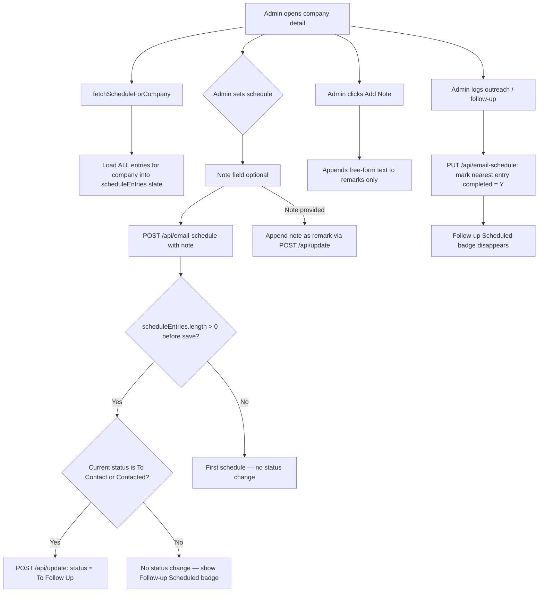
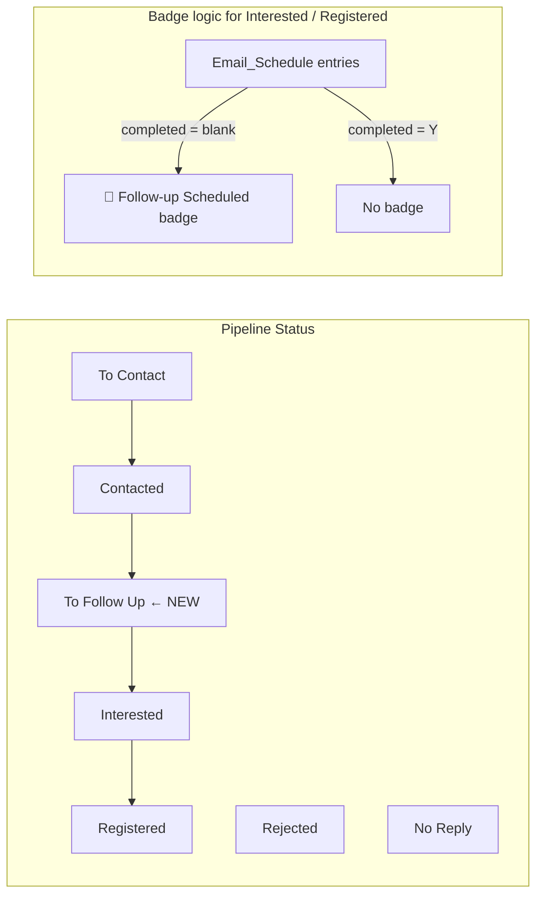
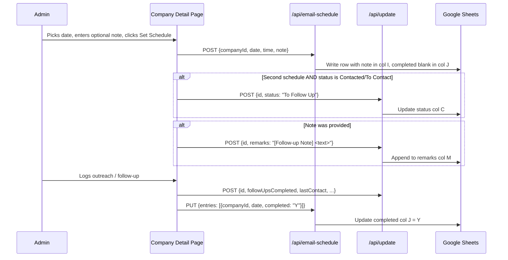

# To Follow Up Status, Schedule Notes & Follow-up Tracking Plan

> **For Claude:** REQUIRED SUB-SKILL: Use superpowers:executing-plans to implement this plan task-by-task.

**Goal:** Add a "To Follow Up" pipeline status, a per-schedule-entry `note` and `completed` field, an "Add note" button on the company detail page, and a full/compact view toggle on the Email Schedule page.

**Architecture:** The `Email_Schedule` sheet gains two new columns (`note`, `completed`). "To Follow Up" is a proper pipeline status, auto-assigned only when a second schedule is saved and the company is still in `To Contact` or `Contacted` state. For companies already in `Interested`/`Registered`, a derived badge from incomplete schedule entries is shown instead of changing the status. Notes are optional at schedule-setting time and always appended to remarks when provided. A free-form "Add note" button on the company detail page saves remarks without any interaction side-effects.

**Tech Stack:** Next.js, TypeScript, Tailwind CSS, Google Sheets API, Heroicons, @dnd-kit/core

---

## Feature / Task Overview

Four related but separable features:

1. **"To Follow Up" status** — a new pipeline stage between Contacted and Interested; auto-assigned when a second outreach is scheduled for early-stage companies.
2. **Schedule entry `note` + `completed` fields** — optional context stored per schedule entry; `completed` is auto-set when outreach is logged and drives a "follow-up scheduled" badge for later-stage companies.
3. **"Add note" button** — free-form remark with no side-effects; fills a gap where admins need to annotate a company without triggering an interaction log.
4. **Email Schedule page full/compact view** — lets admin see the follow-up note alongside each chip for context.

---

## Flow Visualization

---

## Relevant Files

| File | Role |
|------|------|
| `outreach-tracker/lib/email-schedule.ts` | Add `note` and `completed` to `EmailScheduleEntry`; update all read/write/delete ranges from A:H to A:J |
| `outreach-tracker/pages/api/email-schedule/index.ts` | Accept and forward `note` and `completed` fields in POST and PUT handlers |
| `outreach-tracker/pages/companies.tsx` | Add "To Follow Up" to `OUTREACH_STATUSES` constant |
| `outreach-tracker/pages/api/bulk-update-status.ts` | Add "To Follow Up" to `ALLOWED_STATUSES` constant |
| `outreach-tracker/components/AllCompaniesTable.tsx` | Add amber badge colour for "To Follow Up" in `getStatusColor` |
| `outreach-tracker/components/committee-workspace.tsx` | Add "To Follow Up" kanban column in `statusColumns` |
| `outreach-tracker/lib/daily-stats.ts` | Add `toFollowUp` counter and column I in `Daily_Stats` sheet |
| `outreach-tracker/pages/companies/[id].tsx` | `fetchScheduleForCompany` (all entries), note input, auto-status trigger, badge, Add Note button, mark-completed on outreach |
| `outreach-tracker/components/InteractionSection.tsx` | No change needed — "Add note" lives in the parent page, not here |
| `outreach-tracker/pages/email-schedule.tsx` | Full/compact view toggle; show `note` field in full view; show `completed` state on chips |

---

## References and Resources

- `EmailScheduleEntry` interface: `lib/email-schedule.ts` lines 19–28
- `saveEmailScheduleEntries` write logic: `lib/email-schedule.ts` lines 129–201 (range `A:H` → must change to `A:J`)
- `getEmailSchedule` read logic: `lib/email-schedule.ts` lines 38–86 (range `A2:H` → must change to `A2:J`)
- `deleteEmailScheduleEntries` clear range: `lib/email-schedule.ts` lines 230–263 (range `A:J` per row)
- `ScheduleChip` component: `pages/email-schedule.tsx` lines 245–312
- `DroppableSlotBlock` component: `pages/email-schedule.tsx` lines 314–393
- `fetchEntries` function: `pages/email-schedule.tsx` lines 438–473
- `getStatusColor` map: `components/AllCompaniesTable.tsx` lines 534–544
- `statusColumns` array: `components/committee-workspace.tsx` lines 48–55
- `syncDailyStats`: `lib/daily-stats.ts` lines 23–117
- `handleSetOutreachSchedule`: `pages/companies/[id].tsx` lines 268–302
- `handleLogOutreach`: `pages/companies/[id].tsx` lines 436–465
- Admin schedule UI section: `pages/companies/[id].tsx` lines 1548–1610

---

## Phase 1: Extend Email_Schedule schema with `note` and `completed`

### Task 1.1: Update `EmailScheduleEntry` interface and all read/write logic

**Description:** Add `note?: string` and `completed?: string` (value `'Y'` or blank) to the interface. Update every function that reads or writes the sheet to use columns I and J. This is the foundational change all other phases depend on.

**Relevant files:** `lib/email-schedule.ts`

- [ ] Add `note?: string` and `completed?: string` fields to the `EmailScheduleEntry` interface.
- [ ] In `getEmailSchedule`, extend the range from `Email_Schedule!A2:H` to `Email_Schedule!A2:J`. Map `row[8]` → `note`, `row[9]` → `completed`.
- [ ] In `saveEmailScheduleEntries`, extend `rowValues` array to include `entry.note ?? ''` (index 8) and `entry.completed ?? ''` (index 9). Update update range from `A{n}:H{n}` to `A{n}:J{n}`. Update append range similarly.
- [ ] In `deleteEmailScheduleEntries`, extend the `batchClear` range per row from `A{n}:H{n}` to `A{n}:J{n}`.
- [ ] In `deleteEmailScheduleEntriesForCompanies` (if it also hard-codes ranges), extend those ranges to `A:J` as well.
- [ ] Commit: `feat: add note and completed columns to EmailScheduleEntry schema`

#### Dependencies
- None. This is the foundational change.

---

### Task 1.2: Update POST and PUT API handlers to accept `note` and `completed`

**Description:** The API handlers currently ignore any extra fields. They need to extract `note` from POST bodies and `note`/`completed` from PUT bodies, then pass them through to `saveEmailScheduleEntries`.

**Relevant files:** `pages/api/email-schedule/index.ts`

- [ ] In the POST handler, destructure `note?: string` from the request body alongside the existing fields. Pass `note` into each constructed `EmailScheduleEntry` object.
- [ ] In the PUT handler, destructure `note?: string` and `completed?: string` per entry in the `entries` array. Pass both through when reconstructing each `EmailScheduleEntry`.
- [ ] Commit: `feat: forward note and completed fields through email-schedule API`

#### Dependencies
- Task 1.1 must be complete first.

---

## Phase 2: Register "To Follow Up" in all status-aware surfaces

### Task 2.1: Add to status constants

**Description:** Two files define allowed status values. Both must include "To Follow Up" so the status can be set via the API and displayed in dropdowns.

**Relevant files:** `pages/companies.tsx`, `pages/api/bulk-update-status.ts`

- [ ] In `pages/companies.tsx`, insert `'To Follow Up'` into `OUTREACH_STATUSES` between `'Contacted'` and `'Interested'`.
- [ ] In `pages/api/bulk-update-status.ts`, insert `'To Follow Up'` into `ALLOWED_STATUSES` in the same position.
- [ ] Commit: `feat: add To Follow Up to status constants`

### Task 2.2: Add amber badge colour

**Description:** The badge colour map drives the pill styling in the All Companies table. "To Follow Up" should use amber to visually distinguish it from both "Contacted" (blue) and "Interested" (purple).

**Relevant files:** `components/AllCompaniesTable.tsx`

- [ ] In `getStatusColor`, add `'To Follow Up': 'bg-amber-100 text-amber-700'`.
- [ ] Commit: `feat: add amber badge colour for To Follow Up status`

### Task 2.3: Add kanban column in CommitteeWorkspace

**Description:** The committee kanban renders one column per status. Insert "To Follow Up" between "Contacted" and "Interested".

**Relevant files:** `components/committee-workspace.tsx`

- [ ] In `statusColumns`, insert `{ id: 'To Follow Up', label: 'To Follow Up', color: 'bg-amber-50 border-amber-300', accent: 'border-l-amber-400' }` after the `'Contacted'` entry.
- [ ] Commit: `feat: add To Follow Up kanban column`

### Task 2.4: Update daily stats counter

**Description:** `syncDailyStats` counts companies by status and writes to `Daily_Stats` sheet. Add a `toFollowUp` counter and a new column I (additive, non-breaking).

**Relevant files:** `lib/daily-stats.ts`

- [ ] Add `let toFollowUp = 0;` with the other counters.
- [ ] Add `else if (lower === 'to follow up') status = 'To Follow Up';` in the canonicalization block, and `else if (status === 'To Follow Up') toFollowUp++;` in the increment block.
- [ ] Update the header write range to `A1:I1` and add `'To Follow Up'` to the header values array.
- [ ] Update `newValues` to include `toFollowUp` at index 8.
- [ ] Update all existing `A:H` / `A{n}:H{n}` range references to `A:I` / `A{n}:I{n}`.
- [ ] Commit: `feat: track To Follow Up in daily stats`

#### Dependencies
- Task 2.1 must be done first.

---

## Phase 3: Company detail page — schedule entries, note field, auto-status, badge, and mark-completed

### Task 3.1: Load all schedule entries per company

**Description:** `fetchScheduleForCompany` currently uses `entries.find()` and stores only one entry. Change it to filter all entries for the company and store them in an array. This enables both multi-entry display and the "is second schedule?" detection.

**Relevant files:** `pages/companies/[id].tsx`

- [ ] Add `const [scheduleEntries, setScheduleEntries] = useState<EmailScheduleEntry[]>([]);` (or equivalent typed state) near the existing `scheduledDate`/`scheduledTime` state variables.
- [ ] In `fetchScheduleForCompany`, replace the `entries.find(...)` call with `entries.filter(e => e.companyId === company.id)`. Store the filtered array in `setScheduleEntries`.
- [ ] Set `scheduledDate`/`scheduledTime` to the **last** entry's values (most recent scheduled date) for backward-compatibility with display code that still references those variables.
- [ ] Clear `scheduleEntries` to `[]` in `handleClearOutreachSchedule`.
- [ ] Commit: `fix: load all schedule entries per company`

### Task 3.2: Update admin schedule UI to display all entries

**Description:** Replace the single "Scheduled: … at …" line with a list of all schedule entries, each showing its date, time, note (if any), and completion state.

**Relevant files:** `pages/companies/[id].tsx` (admin schedule section, lines 1548–1610)

- [ ] Replace the existing `scheduledDate && scheduledTime` single-entry display block with a mapped list over `scheduleEntries`.
- [ ] Each list item shows: date, formatted time, note (if set), and a green "Completed" or grey "Pending" indicator based on `entry.completed === 'Y'`.
- [ ] The existing "Clear schedule" button clears all entries as before.
- [ ] Commit: `feat: show all schedule entries in company detail admin panel`

### Task 3.3: Add optional note input in schedule form

**Description:** Add an optional text input in the schedule form (below the date/time fields) so admins can record the purpose of the follow-up. When the admin submits the schedule, the note is saved in the `Email_Schedule` entry AND appended to remarks.

**Relevant files:** `pages/companies/[id].tsx`

- [ ] Add `const [outreachScheduleNote, setOutreachScheduleNote] = useState('');` near the existing schedule state variables.
- [ ] In the schedule form UI (below the time input, inside the existing flex-wrap container), add a full-width text input labelled "Note (optional)" bound to `outreachScheduleNote`.
- [ ] In `handleSetOutreachSchedule`, include `note: outreachScheduleNote` in the POST body to `/api/email-schedule`.
- [ ] After the schedule POST succeeds, if `outreachScheduleNote.trim()` is non-empty, call `POST /api/update` with `{ id: company.id, remarks: '[Follow-up Note] <note text>' }` to append the note to the company's remarks. Use the existing remark-appending pattern already present in the file.
- [ ] Clear `outreachScheduleNote` to `''` after a successful save.
- [ ] Commit: `feat: add optional note field when setting outreach schedule`

#### Dependencies
- Task 3.1 must be done first (provides `scheduleEntries` state).

### Task 3.4: Auto-set "To Follow Up" status (guarded)

**Description:** After saving a new schedule entry, if `scheduleEntries.length > 0` before the save AND the current status is `'To Contact'` or `'Contacted'`, automatically set status to "To Follow Up". For companies in any other status (Interested, Registered, Rejected, No Reply), skip the status change — a badge will be shown instead (Task 3.5).

**Relevant files:** `pages/companies/[id].tsx`

- [ ] At the start of `handleSetOutreachSchedule`, capture `const isSecondSchedule = scheduleEntries.length > 0;` and `const isEarlyStage = ['To Contact', 'Contacted'].includes(status);`.
- [ ] After a successful schedule POST, if `isSecondSchedule && isEarlyStage && status !== 'To Follow Up'`, call `POST /api/update` with `{ id: company.id, status: 'To Follow Up' }` and update local `setStatus('To Follow Up')`.
- [ ] If the status update fails, show an error toast but treat the overall operation as a partial success (schedule was saved).
- [ ] Commit: `feat: auto-set To Follow Up status on second schedule for early-stage companies`

#### Dependencies
- Task 3.1 (provides `scheduleEntries` state).
- Phase 2 Task 2.1 (status must be in `ALLOWED_STATUSES`).

### Task 3.5: Show "Follow-up Scheduled" badge for later-stage companies

**Description:** When a company is `Interested` or `Registered` and has at least one incomplete (`completed !== 'Y'`) schedule entry, show a small amber badge in the company detail header area (e.g., "📅 Follow-up scheduled") to give the admin visibility without changing the pipeline status.

**Relevant files:** `pages/companies/[id].tsx`

- [ ] Derive `const hasIncompleteFollowUp = scheduleEntries.some(e => e.completed !== 'Y');` from the `scheduleEntries` state.
- [ ] Derive `const isLaterStage = ['Interested', 'Registered'].includes(status);`.
- [ ] In the company detail header area (near the existing status badge), conditionally render a small amber pill badge reading "Follow-up scheduled" when `hasIncompleteFollowUp && isLaterStage`.
- [ ] Commit: `feat: show follow-up scheduled badge for interested/registered companies`

#### Dependencies
- Task 3.1 (provides `scheduleEntries` state).

### Task 3.6: Mark schedule entry as completed when outreach is logged

**Description:** When `handleLogOutreach` succeeds (first outreach or follow-up), automatically mark the most recent incomplete schedule entry for this company as `completed = 'Y'` via `PUT /api/email-schedule`. This clears the "Follow-up scheduled" badge once the admin has actually sent the email.

**Relevant files:** `pages/companies/[id].tsx`

- [ ] After the `POST /api/update` call in `handleSave` succeeds (or directly after `handleLogOutreach` stages its changes and a save is triggered), find the most recent incomplete entry: `scheduleEntries.filter(e => e.completed !== 'Y').sort by date desc → take first`.
- [ ] If such an entry exists, call `PUT /api/email-schedule` with `{ entries: [{ ...entry, completed: 'Y' }] }`.
- [ ] Call `fetchScheduleForCompany()` afterwards to refresh `scheduleEntries`.
- [ ] If the PUT fails, log the error silently — the outreach log is more important than the completion mark.
- [ ] Commit: `feat: auto-mark schedule entry completed when outreach is logged`

#### Dependencies
- Tasks 3.1, 1.1, 1.2 must all be done first.

---

## Phase 4: "Add Note" button on company detail page

### Task 4.1: Implement free-form note button

**Description:** There is currently no way to save a remark without also triggering an interaction log (follow-up count, status change, etc.). A standalone "Add note" text area + button fills this gap. It appends `[Note] <text>` to remarks only, with no other side-effects.

**Relevant files:** `pages/companies/[id].tsx`

- [ ] Add `const [freeNote, setFreeNote] = useState('');` in state.
- [ ] Add a `handleAddNote` async callback that: (a) calls `POST /api/update` with `{ id: company.id, remarks: '[Note] <freeNote.trim()>' }`, (b) shows a success/failure toast, (c) clears `freeNote`.
- [ ] In the company detail page UI, place a small "Add note" section in the remarks/interaction area — a `<textarea>` (2 rows) + an "Add note" button. The button is disabled when `freeNote.trim()` is empty or a save is in progress.
- [ ] The "Add note" block should be visually distinct from the interaction buttons (e.g., labelled "Quick note", positioned below the interaction section).
- [ ] Commit: `feat: add free-form note button to company detail page`

---

## Phase 5: Email Schedule page — full/compact view + note display + completed state

### Task 5.1: Add view toggle state

**Description:** The Email Schedule page currently has no view mode control. Add a `viewMode: 'full' | 'compact'` state with a toggle button in the page toolbar.

**Relevant files:** `pages/email-schedule.tsx`

- [ ] Add `const [viewMode, setViewMode] = useState<'full' | 'compact'>('compact');` to the page state (default compact to preserve existing UX).
- [ ] Add a toggle button in the page toolbar area (near other controls) that switches between Full and Compact, using a layout icon pair (e.g., `Squares2X2Icon` for full, `ListBulletIcon` for compact — both already imported).
- [ ] Pass `viewMode` down to `DroppableSlotBlock` and `ScheduleChip` as a prop.
- [ ] Commit: `feat: add full/compact view toggle to email schedule page`

### Task 5.2: Show note in full view

**Description:** In full view, each chip should display the `note` field below the company name if one exists. In compact view, the chip renders exactly as today (no note shown).

**Relevant files:** `pages/email-schedule.tsx`

- [ ] Extend the `ScheduleEntry` interface (or equivalent) used in the page to include `note?: string` and `completed?: string`.
- [ ] In `ScheduleChip`, accept a `viewMode` prop. When `viewMode === 'full'` and `entry.note` is non-empty, render the note text below the company name in `text-xs text-slate-500 italic`.
- [ ] Commit: `feat: show schedule note in full view chip`

### Task 5.3: Show completed state on chips

**Description:** Chips for entries where `completed === 'Y'` should visually indicate the outreach has been sent. Use the existing green border / `CheckCircleIcon` pattern already present for the `isContacted` state — or unify the two.

**Relevant files:** `pages/email-schedule.tsx`

- [ ] Pass `isCompleted = entry.completed === 'Y'` to `ScheduleChip` (similar to how `isContacted` is passed today).
- [ ] In `ScheduleChip`, when `isCompleted` is true, apply `border-green-400 bg-green-50` and show the `CheckCircleIcon`. This may overlap with the existing `isContacted` style — confirm they are consistent or choose one signal to take priority.
- [ ] In `fetchEntries`, ensure `entry.note` and `entry.completed` are preserved when mapping the API response into the local `entries` state.
- [ ] Commit: `feat: show completed state on email schedule chips`

#### Dependencies
- Phase 1 (Tasks 1.1 and 1.2) must be done first for the API to return `note` and `completed`.

---

## Potential Risks / Edge Cases

- **Column range expansion from A:H to A:J:** Any place that hard-codes `A:H` in sheet range strings will silently skip columns I and J. Audit all uses of `SCHEDULE_SHEET` in `lib/email-schedule.ts` for hard-coded range strings before shipping.
- **Existing rows in the sheet:** Current rows have no data in columns I and J. Reading them returns `undefined` for `note` and `completed` — both are optional, so the code should handle this gracefully without special migration.
- **`deleteEmailScheduleEntries` clears rows, doesn't delete them:** Blanked rows produce empty `row[0]` and are already filtered out in `getEmailSchedule`. The extended range `A:J` clear is backward-compatible.
- **Auto "To Follow Up" and manual status override:** If an admin manually sets a company back to "Contacted" and then sets a second schedule again, it will trigger "To Follow Up" again. This is intentional and correct behaviour.
- **"Follow-up scheduled" badge for Interested/Registered — stale data:** The badge derives from `scheduleEntries` which is fetched on page load. After marking complete in another tab, the badge won't disappear until the page is refreshed. This is an acceptable known limitation.
- **Note auto-append to remarks race condition:** The note remark is appended via a separate `POST /api/update` call after the schedule POST. If both calls fire but the remark call fails, the note is saved in Email_Schedule but not in remarks. Treat this as non-critical (schedule saved is more important). Log the failure and show an error toast.
- **Daily_Stats sheet column shift:** Column I was previously unused. Adding it is purely additive. Old rows remain without a column I value — that is fine since the sheet is append-only and historical rows don't need backfill.
- **`isContacted` vs `isCompleted` on email schedule chips:** Both drive a green chip style. Decide whether to unify them (green = "done for any reason") or differentiate (e.g., `isCompleted` uses a tick icon, `isContacted` uses the existing green-border style).

---

## Testing Checklist

### "To Follow Up" Status

- [ ] Open All Companies → status filter dropdown → confirm "To Follow Up" appears between "Contacted" and "Interested".
- [ ] Open Committee Workspace → confirm a "To Follow Up" column appears between Contacted and Interested.
- [ ] Manually set a company's status to "To Follow Up" → confirm amber badge renders in All Companies table.

### Auto-status Trigger

- [ ] Open a company with status "To Contact" and no schedule entries. Set a first schedule. Confirm status does NOT change.
- [ ] On the same company (now has one entry), set a second schedule on a different date. Confirm status automatically changes to "To Follow Up".
- [ ] Open a company with status "Interested" and no schedule entries. Set a first schedule. Confirm status stays "Interested". Confirm "Follow-up Scheduled" badge appears in the header.
- [ ] Open a company with status "Registered". Set a second schedule. Confirm status stays "Registered" and badge appears.

### Schedule Note

- [ ] On a company, set a schedule with a note. Confirm the note appears in the scheduled entries list in the admin panel.
- [ ] After setting a schedule with a note, open the Remarks section and confirm `[Follow-up Note] <text>` was appended.
- [ ] Set a schedule with no note. Confirm no remark is appended.

### Mark as Completed

- [ ] Schedule a company for today. Log outreach from the company detail page. Confirm the schedule entry in the admin panel now shows a "Completed" indicator.
- [ ] On the Email Schedule page (full view), confirm that chip for this company now shows the green completed state.
- [ ] Confirm the "Follow-up Scheduled" badge disappears from an Interested/Registered company once the schedule entry is marked completed.

### "Add Note" Button

- [ ] On any company, type a note in the "Quick note" area and click "Add note". Confirm the text appears in remarks with `[Note]` prefix and no status or follow-up count changes.
- [ ] Confirm the "Add note" button is disabled when the note textarea is empty.

### Email Schedule Page — Full/Compact View

- [ ] Toggle to Full view. Confirm chips with a note show the note text below the company name.
- [ ] Confirm chips without a note render identically to compact view.
- [ ] Toggle back to Compact view. Confirm note text is hidden and chips look the same as before this feature was added.
- [ ] Confirm completed chips show a green border / checkmark in both views.

### All Schedule Entries Display

- [ ] On a company with two schedule entries (different dates), confirm the admin panel lists both entries.
- [ ] Click "Clear schedule". Confirm both entries are removed.

---

## Notes

- **"To Follow Up" badge colour — amber:** Amber sits between blue (Contacted) and orange (Interested) in Tailwind's scale and clearly signals "action needed". Use `bg-amber-100 text-amber-700` for badges and `bg-amber-50 border-amber-300 border-l-amber-400` for the kanban column.
- **Full view default vs compact:** Defaulting to compact preserves the existing visual density. Admins who want to see notes can switch to full. The preference is not persisted across sessions unless explicitly requested later.
- **`completed` field value:** Use the string `'Y'` (consistent with typical Google Sheets boolean convention) rather than a boolean, since all sheet values come back as strings.
- **Schedule entry order in admin panel:** Display entries sorted by date ascending so the chronological follow-up trail is easy to read.
