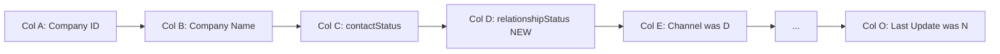
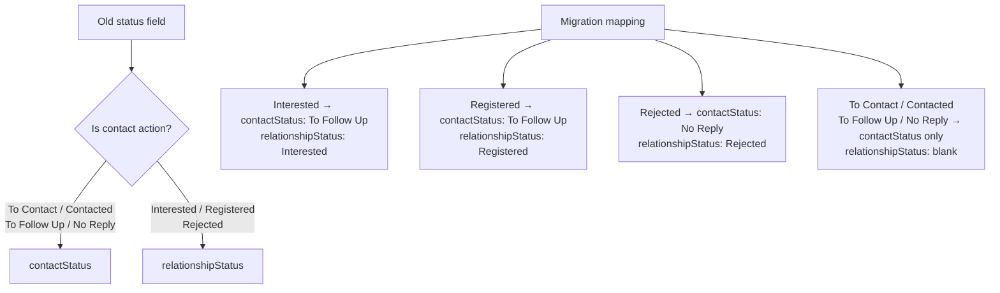
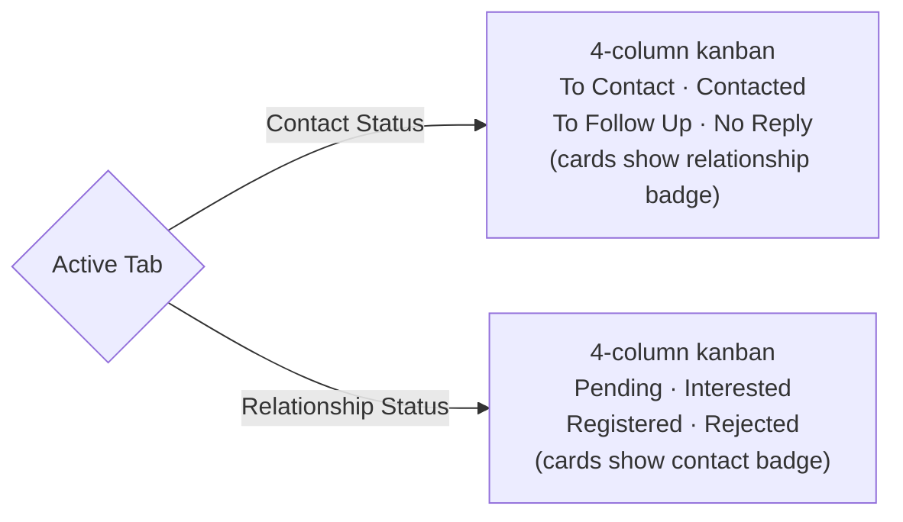

# Dual Status Split Implementation Plan

> **For Claude:** REQUIRED SUB-SKILL: Use superpowers:executing-plans to implement this plan task-by-task.

**Goal:** Split the single `status` field into two independent fields — `contactStatus` (outreach actions) and `relationshipStatus` (company disposition) — so that a company's engagement level is never lost when the outreach pipeline advances.

**Architecture:** A new column D (`relationshipStatus`) is inserted into the Outreach Tracker Google Sheet, shifting all existing columns D–N right by one to become E–O. All API endpoints, data parsers, and UI components are updated to read and write the two fields independently. The committee workspace kanban gains a tab toggle to view companies by either axis.

**Tech Stack:** Next.js (API routes), TypeScript, Google Sheets API v4, React, Tailwind CSS

---

## Flow Visualization

### Data Model After Migration

### Status Split Logic

### Committee Workspace Dual Kanban

---

## Relevant Files

| File | Role |
|---|---|
| `pages/api/data.ts` | Row parser — all column indices shift; must expose both new fields |
| `pages/api/update.ts` | TRACKER_MAP column letters shift; auto-No Reply range shifts; verify range extends |
| `pages/api/bulk-update-status.ts` | Gains `field` param to target contactStatus or relationshipStatus |
| `pages/api/add-company.ts` | Tracker row array gains new empty D position; all subsequent positions shift |
| `pages/api/bulk-assign.ts` | Column index range reference shifts (A:N → A:O) |
| `pages/api/reorder-rows.ts` | Column index range reference shifts |
| `pages/api/me.ts` | No changes needed (no direct sheet column access) |
| `pages/api/email-schedule/index.ts` | Reads status for scheduling — update to read contactStatus |
| `pages/api/email-schedule/settings.ts` | Audit trail; check for any status references |
| `lib/daily-stats.ts` | Fetch range A2:C → A2:D; split counting into contact vs relationship |
| `pages/companies.tsx` | Bulk status UI: one dropdown becomes two; `OUTREACH_STATUSES` splits |
| `pages/companies/[id].tsx` | Company interface, status dropdowns, status badge, status colour helper |
| `components/AllCompaniesTable.tsx` | Two status badges per row; two filter dropdowns; column header update |
| `components/committee-workspace.tsx` | Tab toggle; `statusColumns` splits into two arrays; `isFollowUpEligible` logic update; bulk action bar refactor |
| `components/DashboardStats.tsx` | Stats display — check for any hardcoded status references |
| `pages/analytics.tsx` | Timeline metrics and chart labels remain compatible; verify daily stats mapping |
| `scripts/migrate-status-split.ts` | NEW — one-time migration script; inserts column D; maps old values |

---

## References and Resources

- [Google Sheets API — InsertDimension](https://developers.google.com/sheets/api/reference/rest/v4/spreadsheets/request#InsertDimensionRequest) — required to insert column D without overwriting existing data
- [Google Sheets API — batchUpdate values](https://developers.google.com/sheets/api/reference/rest/v4/spreadsheets.values/batchUpdate) — for writing migrated values

---

## Phase 1: Google Sheets Schema Migration

### Task 1.1: Write the migration script

**Files:**
- Create: `outreach-tracker/scripts/migrate-status-split.ts`

- [ ] Read all existing rows from the Outreach Tracker sheet (SPREADSHEET_ID_2, first sheet tab, rows A2:N)
- [ ] Use `spreadsheets.batchUpdate` with an `insertDimension` request to insert a blank column at index 3 (0-based = column D), shifting D–N to E–O
- [ ] Update the header row: write `Contact Status` to C1 and `Relationship Status` to D1
- [ ] For each data row, read the old `status` value (now in column C post-insert), determine the migration mapping, and build a batch write:
  - `To Contact / Contacted / To Follow Up / No Reply` → contactStatus = same value, relationshipStatus = blank
  - `Interested` → contactStatus = `To Follow Up`, relationshipStatus = `Interested`
  - `Registered` → contactStatus = `To Follow Up`, relationshipStatus = `Registered`
  - `Rejected` → contactStatus = `No Reply`, relationshipStatus = `Rejected`
- [ ] Execute the batch write in a single `values.batchUpdate` call
- [ ] Log a summary: total rows processed, how many had each old status value
- [ ] Add a `--dry-run` flag that prints what would be written without making changes

**Dependencies:** Must be run before any backend changes go live.

---

## Phase 2: Backend / API Layer

### Task 2.1: Update the data API row parser

**Files:**
- Modify: `pages/api/data.ts`

- [ ] Change tracker fetch range from `A2:N` to `A2:O`
- [ ] Update `trackerMap` row parsing — shift all indices from D onwards by +1:
  - `row[2]` = contactStatus (was `status`)
  - `row[3]` = relationshipStatus (NEW)
  - `row[4]` = channel (was `row[3]`)
  - `row[5]` = urgencyScore (was `row[4]`)
  - `row[6]` = previousResponse (was `row[5]`)
  - `row[7]` = assignedPic (was `row[6]`)
  - `row[8]` = lastCompanyContact (was `row[7]`)
  - `row[9]` = lastContact (was `row[8]`)
  - `row[10]` = followUpsCompleted (was `row[9]`)
  - `row[11]` = sponsorshipTier (was `row[10]`)
  - `row[12]` = daysAttending (was `row[11]`)
  - `row[13]` = remarks (was `row[12]`)
  - `row[14]` = lastUpdate (was `row[13]`)
- [ ] Update `companyMap` construction to expose `contactStatus` and `relationshipStatus` as separate fields (remove the old single `status` field)
- [ ] Update Daily_Stats fetch: the existing 9-column structure (Date, Total, To Contact, Contacted, To Follow Up, Interested, Registered, No Reply, Rejected) maps cleanly — no header change needed, just verify the column mapping comments

### Task 2.2: Update the main update API

**Files:**
- Modify: `pages/api/update.ts`

- [ ] Update `TRACKER_MAP` — rename `status` → `contactStatus` (keeps column `C`), add `relationshipStatus: 'D'`, shift all columns from D onwards: channel→E, urgencyScore→F, previousResponse→G, assignedPic→H, lastCompanyContact→I, lastContact→J, followUpsCompleted→K, sponsorshipTier→L, daysAttending→M, remarks→N, lastUpdate→O
- [ ] Update the auto-No Reply range read from `F${row}:J${row}` to `G${row}:K${row}` (all shifted by one column letter; the relative indices [2], [3], [4] within the range remain the same)
- [ ] Update the auto-No Reply write to use `TRACKER_MAP['contactStatus']` instead of `TRACKER_MAP['status']`
- [ ] Update the verify range from `A${row}:N${row}` to `A${row}:O${row}`
- [ ] Update `verifiedData` indices to match new positions: contactStatus=`updatedRow[2]`, relationshipStatus=`updatedRow[3]`, followUpsCompleted=`updatedRow[10]`, lastContact=`updatedRow[9]`, remark=`updatedRow[13]`, daysAttending=`updatedRow[12]`, lastUpdated=`updatedRow[14]`
- [ ] Return both `contactStatus` and `relationshipStatus` in `verifiedData`

### Task 2.3: Update the bulk status API

**Files:**
- Modify: `pages/api/bulk-update-status.ts`

- [ ] Change the request body to accept `field: 'contactStatus' | 'relationshipStatus'` and `value: string` (instead of the single `status` field)
- [ ] Define `CONTACT_STATUSES` and `RELATIONSHIP_STATUSES` constant arrays; validate `value` against the appropriate array based on `field`
- [ ] Look up the target column by header name (`contact status` or `relationship status`) using the existing header-scan logic; update the header lookup strings accordingly
- [ ] Update Thread_History log message to mention which field was updated

### Task 2.4: Update add-company API

**Files:**
- Modify: `pages/api/add-company.ts`

- [ ] Insert a blank value for `relationshipStatus` at position D in the `trackerRow` array (index 3), shifting all existing values from index 3 onwards by +1
- [ ] Confirm the final row order: A=ID, B=Name, C=`To Contact`, D=blank, E=channel, F=urgencyScore, G=previousResponse, H=assignedPIC, I=lastCompanyContact, J=lastContact, K=followUpsCompleted, L=sponsorshipTier, M=daysAttending, N=remarks, O=timestamp

### Task 2.5: Fix column range references in remaining APIs

**Files:**
- Modify: `pages/api/bulk-assign.ts`
- Modify: `pages/api/reorder-rows.ts`
- Modify: `pages/api/email-schedule/index.ts`
- Modify: `pages/api/email-schedule/settings.ts`

- [ ] Audit each file for hardcoded column ranges (e.g. `A:N`) and update them to `A:O` where applicable
- [ ] In `email-schedule/index.ts`, find any reference to `status` and update to `contactStatus`
- [ ] Commit all Phase 2 changes together after verifying locally

### Task 2.6: Update daily-stats lib

**Files:**
- Modify: `lib/daily-stats.ts`

- [ ] Change fetch range from `A2:C` to `A2:D` to include the new relationshipStatus column
- [ ] Split counting logic: contact status counts read from `row[2]` (toContact, contacted, toFollowUp, noReply); relationship status counts read from `row[3]` (interested, registered, rejected)
- [ ] A single company can now contribute to both a contact count AND a relationship count — this is intentional and correct
- [ ] The existing Daily_Stats sheet header row (`To Contact, Contacted, To Follow Up, Interested, Registered, No Reply, Rejected`) semantics now map cleanly: the first four are contact statuses, the last three are relationship statuses — no header change required

---

## Phase 3: Companies Table & Bulk Status UI

### Task 3.1: Update AllCompaniesTable

**Files:**
- Modify: `components/AllCompaniesTable.tsx`

- [ ] Update the `Company` TypeScript interface: replace `status: string` with `contactStatus: string` and `relationshipStatus: string`
- [ ] Replace `getStatusColor` to operate on `contactStatus`; add a separate `getRelationshipColor` helper for relationship status badges
- [ ] Replace the single status badge cell with two badge elements side by side: contactStatus badge (always shown) + relationshipStatus badge (only shown if non-empty)
- [ ] Split `statuses` filter memo into `contactStatuses` and `relationshipStatuses`; replace the single status `FilterRowMultiSelect` column with two separate filter dropdowns

### Task 3.2: Update companies page bulk status UI

**Files:**
- Modify: `pages/companies.tsx`

- [ ] Replace `OUTREACH_STATUSES` with `CONTACT_STATUSES = ['To Contact', 'Contacted', 'To Follow Up', 'No Reply']` and `RELATIONSHIP_STATUSES = ['Interested', 'Registered', 'Rejected']`
- [ ] Replace the single bulk status dropdown with two labelled dropdowns: one for contact status, one for relationship status; each has its own "Set" button
- [ ] Update `handleBulkSetStatus` to accept a `field` parameter and pass it to the updated `bulk-update-status` API
- [ ] Update any filter/search logic that references the old combined `status` field

---

## Phase 4: Company Detail Page

**Files:**
- Modify: `pages/companies/[id].tsx`

- [ ] Update the `Company` TypeScript interface to use `contactStatus` and `relationshipStatus`
- [ ] Replace `statusOptions` constant with `contactStatusOptions` and `relationshipStatusOptions`
- [ ] Replace the single status `<select>` with two labelled selects side by side: one for contact status, one for relationship status
- [ ] Update `getStatusColor` to operate on `contactStatus`; add `getRelationshipColor` for relationship status
- [ ] Update the status badge shown in the page header to show both badges
- [ ] Update the save handler to send updates using the new field names (`contactStatus`, `relationshipStatus`) instead of `status`
- [ ] The rejection reason UI currently gates on `status === 'Rejected'` — update this gate to `relationshipStatus === 'Rejected'`

---

## Phase 5: Committee Workspace Dual Kanban

**Files:**
- Modify: `components/committee-workspace.tsx`

- [ ] Update the `Company` interface to use `contactStatus` and `relationshipStatus`
- [ ] Define two separate column config arrays:
  - `CONTACT_COLUMNS`: To Contact, Contacted, To Follow Up, No Reply (with colours)
  - `RELATIONSHIP_COLUMNS`: Pending (blank relationshipStatus), Interested, Registered, Rejected (with colours)
- [ ] Add a `kanbanView: 'contact' | 'relationship'` state (default `'contact'`); render a tab toggle control in the header section
- [ ] The active column config drives the grouping logic:
  - Contact view: group by `contactStatus`
  - Relationship view: group by `relationshipStatus || 'Pending'`
- [ ] Each card in contact view shows a small relationship badge when `relationshipStatus` is non-empty; each card in relationship view shows a small contact badge
- [ ] Update `isFollowUpEligible` — simplify: a company is eligible when `contactStatus` is `Contacted`, `To Follow Up`, or `No Reply`; remove the old Interested/Registered special-case time check (this is now correctly reflected by the contact status)
- [ ] Update `markAsFirstOutreach` to send `contactStatus: 'Contacted'` instead of `status: 'Contacted'`
- [ ] Update `markAsCompanyReply` to send `{ contactStatus: 'To Follow Up', relationshipStatus: 'Interested' }` — the company replied positively so we set relationship to Interested and move contact to To Follow Up
- [ ] Update `markAsFollowUp` — this only increments `followUpsCompleted` and `lastContact`, no status field change needed (already correct)
- [ ] Update `markAsOurReply` — already only sets `lastContact`, no status change needed

---

## Phase 6: Analytics

**Files:**
- Modify: `pages/analytics.tsx`
- Modify: `components/DashboardStats.tsx`

- [ ] In `analytics.tsx`, audit `TimelineMetric` type and chart labels; `contacted`, `interested`, `registered` still read from `dailyStats` the same column indices — verify these remain correct after daily-stats changes
- [ ] In `DashboardStats.tsx`, audit any hardcoded references to the old `status` string or combined status counts; update to use the new field names from the data response
- [ ] Verify the analytics line chart still renders correctly with the updated daily stats semantics (contact counts vs relationship counts are now independent)

---

## Potential Risks / Edge Cases

1. **Column insertion timing:** The migration script must run and complete before any updated API code is deployed. If the API goes live first, it will write to wrong columns. Plan deployment order: run migration → deploy API → deploy UI.

2. **Existing `bulk-update-status` callers:** The API signature changes (adds `field` param). The companies page calls this endpoint — ensure the UI and API changes are deployed together or the API accepts both old and new call shapes during a transition window.

3. **Header-based column lookup in `bulk-update-status.ts`:** The current code scans for a header named `status`. After migration the header will be `Contact Status`. If the header scan fails (e.g. capitalisation mismatch), no updates will be written. Confirm the exact header string written by the migration script matches what the API looks for.

4. **`isFollowUpEligible` removal of time-based check:** The old logic allowed Interested/Registered companies to appear eligible after 3 days of no response. After the split, follow-up eligibility is driven purely by contactStatus. Ensure that when "Log company response" fires (setting contactStatus → To Follow Up), the card moves to the correct kanban column immediately on refresh.

5. **Daily Stats backward compatibility:** The analytics page reads `dailyStats` from the API with fields `interested`, `registered`, `toContact`, etc. After the split, these counts have different semantics (interested/registered now count by relationship field; toContact/contacted count by contact field). The numbers can now be higher than the total (a company is counted in both a contact stat and a relationship stat). Verify the analytics chart does not assume `sum of all statuses == total`.

6. **No Reply auto-transition:** The auto-No Reply logic in `update.ts` checks `currentFollowUps >= 3` and writes to `contactStatus`. Verify that it does not accidentally overwrite a company's `relationshipStatus` when auto-triggering.

7. **Cache invalidation:** After the migration script runs on the sheet, the in-memory cache (`cache.delete('sheet_data')`) must be cleared before the first API call with new code. The migration script should call the clear-cache endpoint or the cache will serve stale pre-migration data.

---

## Testing Checklist

### Migration
- [ ] Run migration script with `--dry-run` and confirm the printed output matches expected mappings for all status types
- [ ] Run migration script for real; open the Google Sheet and verify: column D header is "Relationship Status", all previously-Interested companies now show "To Follow Up" in C and "Interested" in D, Rejected → "No Reply" / "Rejected", Registered → "To Follow Up" / "Registered"
- [ ] Verify all other columns (E onwards) still contain correct data (not shifted incorrectly)

### API
- [ ] Fetch `/api/data` and confirm each company object has both `contactStatus` and `relationshipStatus` fields
- [ ] Update a company's contact status only (e.g. To Contact → Contacted) and confirm relationship status is untouched
- [ ] Update a company's relationship status only (e.g. blank → Interested) and confirm contact status is untouched
- [ ] Add a new company and confirm the sheet row has the correct 15 columns with blank relationshipStatus

### All Companies Table
- [ ] Companies page loads and shows two status badges per row (contact badge always visible, relationship badge only when set)
- [ ] Filter by contact status (e.g. "To Follow Up") shows only companies with that contactStatus
- [ ] Filter by relationship status (e.g. "Interested") shows only companies with that relationshipStatus
- [ ] Bulk-setting contact status on selected companies updates only contactStatus; reload confirms relationship is unchanged
- [ ] Bulk-setting relationship status on selected companies updates only relationshipStatus

### Company Detail Page
- [ ] Detail page shows two separate status dropdowns
- [ ] Changing contact status dropdown and saving updates contactStatus only
- [ ] Changing relationship status to "Rejected" reveals the rejection reason field
- [ ] Both status badges visible in the page header

### Committee Workspace
- [ ] Default tab is "Contact Status"; kanban shows 4 columns (To Contact, Contacted, To Follow Up, No Reply)
- [ ] Cards in contact view with a relationship status show a small coloured relationship badge on the card
- [ ] Switching to "Relationship Status" tab shows 4 columns (Pending, Interested, Registered, Rejected); companies with no relationship status appear in Pending
- [ ] "Log outreach" action moves a company from To Contact → Contacted in the contact kanban
- [ ] "Log company response" action sets relationship to Interested and contact to To Follow Up; company appears in To Follow Up column (contact view) and Interested column (relationship view)
- [ ] "Log follow up" increments follow-up count with no status changes
- [ ] After 3 follow-ups with no response (>3 days), auto-transition sets contactStatus to No Reply; relationship status unchanged

### Analytics
- [ ] Analytics page loads without errors
- [ ] Outreach Performance chart still renders the contacted/interested/registered lines
- [ ] Dashboard stats show correct counts for each status
