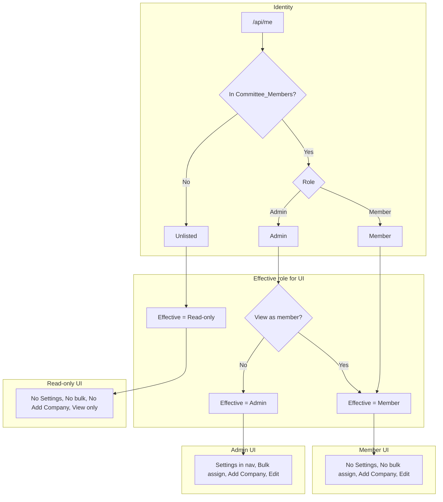
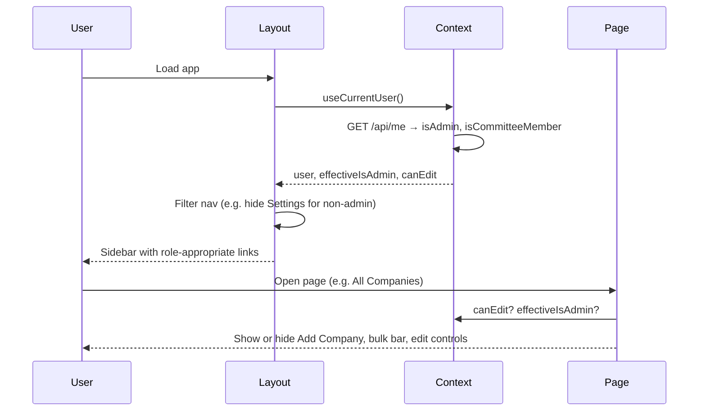

# Admin vs Member User Interfaces — Implementation Plan

## Status: Updated

The optional **“view as member”** UI-masking mode described in this plan has been replaced by **SuperAdmin impersonation** (server-authoritative, per-member). Use impersonation state to derive any “effective role”; do not reintroduce localStorage-based role masking.

## 1. Feature/Task Overview

- **Purpose:** Define and implement distinct user interfaces for **Admin**, **Member**, and **Unlisted (read-only)** users so that navigation, page access, and write actions (add company, edit company/contacts, bulk assign) are shown or hidden according to role. Optionally, allow admins to **view as member** to experience the member UI.
- **Scope:** Frontend and layout only: sidebar/nav, Settings route protection, per-page controls (Add Company, bulk assign, company/contact edit), and read-only experience for unlisted users. Depends on `/api/me` exposing `isAdmin` and `isCommitteeMember` (or equivalent) and on backend enforcement of write permissions; those are covered in the Google Login & Sheet-Based Roles plan.

---

## 2. Flow Visualization

---

## 3. Relevant Files

| File | Role |
|------|------|
| `outreach-tracker/contexts/CurrentUserContext.tsx` | Expose `user` with `isAdmin`, `isCommitteeMember` (or `canEdit`); optional `viewAsMember` state and `effectiveIsAdmin` for UI. |
| `outreach-tracker/components/Layout.tsx` | Sidebar navigation: show Settings only when effective admin; optional "View as member" / "Exit member view" for admins; profile block links to Settings only if admin, else non-clickable or different target. |
| `outreach-tracker/components/AdminRoute.tsx` | New component: wrap Settings page content; redirect or show forbidden when user is not admin (real role, not effective). |
| `outreach-tracker/pages/settings.tsx` | Wrap main content with `AdminRoute` so only admins can see the page; direct URL access blocked for others. |
| `outreach-tracker/pages/companies.tsx` | Show "Add Company" and any bulk-assign toolbar only when user can edit (committee member) and bulk bar only when effective admin. |
| `outreach-tracker/pages/companies/[id].tsx` | Show edit/save, Add Contact, edit/delete contact, flag, and other mutable controls only when `canEdit`; for read-only users show view-only layout and e.g. single "Refresh" in footer. |
| `outreach-tracker/pages/index.tsx` | If any dashboard actions are write (e.g. quick-add), gate by `canEdit`. |
| `outreach-tracker/pages/committee.tsx` | Gate any write actions by `canEdit` if present. |
| `outreach-tracker/pages/analytics.tsx` | Typically read-only; no change unless export or similar is added later. |

---

## 4. References and Resources

- **Role and auth:** `docs/plans/google-login-sheet-roles-plan.md` — roles (Admin / Member), unlisted = read-only, `/api/me` contract.
- **Settings and view-as-member:** `docs/plans/settings-admin-view-as-member-plan.md` — detailed behavior for Settings, view-as-member, and which actions each role gets.
- **Auth and user model:** `outreach-tracker/docs/CURRENT_USER_AND_AUTH.md`.

---

## 5. Task Breakdown

### Phase 1: Context and role flags for UI

#### Task 1.1 — Extend /api/me and CurrentUser for UI

- **Description:** Ensure the app has the flags needed for UI decisions: isAdmin, isCommitteeMember (or canEdit). CurrentUserContext must expose them (and optionally effectiveIsAdmin when view-as-member is implemented).
- **Relevant files:** `outreach-tracker/pages/api/me.ts`, `outreach-tracker/contexts/CurrentUserContext.tsx`
- **Sub-tasks:**
  - [ ] In `/api/me`, return `isAdmin` and `isCommitteeMember` (or equivalent) based on Committee_Members lookup and normalized role (see google-login-sheet-roles plan).
  - [ ] In CurrentUserContext, store and expose `isAdmin` and `isCommitteeMember` (and derived `canEdit` if desired) so Layout and pages can branch on role without parsing role string.

#### Task 1.2 — Optional: View-as-member state and effective role

- **Description:** If "view as member" is in scope: add viewAsMember state (e.g. persisted to localStorage), and compute effectiveIsAdmin (false when admin has toggled view-as-member) for UI only; do not use effective role for route protection or API.
- **Relevant files:** `outreach-tracker/contexts/CurrentUserContext.tsx`
- **Sub-tasks:**
  - [ ] Add viewAsMember boolean and setViewAsMember; persist to a stable localStorage key; clear when user is not admin.
  - [ ] Expose effectiveIsAdmin = isAdmin && !viewAsMember for sidebar and bulk-assign visibility only.

### Phase 2: Layout and navigation

#### Task 2.1 — Role-based sidebar and profile

- **Description:** Show Settings in the sidebar only when the user is an effective admin; for members and unlisted, omit Settings. Profile block: link to Settings only for admins; for others show profile info without Settings link (or link to a read-only profile if desired).
- **Relevant files:** `outreach-tracker/components/Layout.tsx`
- **Sub-tasks:**
  - [ ] Build navigation array (or filter) so Settings entry is included only when effectiveIsAdmin (or real isAdmin if not using view-as-member).
  - [ ] In the user profile area, make the Settings link conditional on admin; for non-admins show name/role only (no cog link to Settings).

#### Task 2.2 — Optional: View-as-member toggle in Layout

- **Description:** For users who are real admins, show a "View as member" toggle (or "Exit member view" when active); switching updates context and refreshes nav/bulk visibility.
- **Relevant files:** `outreach-tracker/components/Layout.tsx`, `outreach-tracker/contexts/CurrentUserContext.tsx`
- **Sub-tasks:**
  - [ ] Add a compact control (e.g. in sidebar or header) visible only when user.isAdmin; toggle viewAsMember and ensure Layout re-renders with effective role.
  - [ ] When viewAsMember is true, sidebar should match member UI (no Settings); bulk bar on All Companies hidden.

### Phase 3: Settings page — admin only

#### Task 3.1 — Protect Settings route

- **Description:** Only admins can open the Settings page; direct URL access for non-admins should redirect (e.g. to home) or show an access-denied message.
- **Relevant files:** `outreach-tracker/components/AdminRoute.tsx`, `outreach-tracker/pages/settings.tsx`
- **Sub-tasks:**
  - [ ] Create AdminRoute component: children rendered only when user is admin (use real isAdmin from context); otherwise redirect to `/` or show a short "Access denied" with link home.
  - [ ] Wrap the main Settings content in settings.tsx with AdminRoute so the default export renders AdminRoute wrapping the main Settings content component.

### Phase 4: All Companies page

#### Task 4.1 — Add Company and bulk-assign by role

- **Description:** "Add Company" (or equivalent) visible only to users who can edit (committee members: Admin and Member). Bulk-assign toolbar or bar visible only to effective admins.
- **Relevant files:** `outreach-tracker/pages/companies.tsx`, table/toolbar components used there (e.g. AllCompaniesTable if it hosts the button)
- **Sub-tasks:**
  - [ ] Add or locate "Add Company" control; render it only when user is committee member (canEdit / isCommitteeMember).
  - [ ] If bulk-assign UI exists (or is added), show it only when effectiveIsAdmin; hide for members and unlisted.

#### Task 4.2 — Read-only experience on All Companies

- **Description:** Unlisted users see the company list but no add or bulk actions; table is view-only (no row actions that mutate, if any).
- **Relevant files:** `outreach-tracker/pages/companies.tsx`, `outreach-tracker/components/AllCompaniesTable.tsx`
- **Sub-tasks:**
  - [ ] Pass canEdit (or isCommitteeMember) into the table/page so that row-level write actions (if any) are hidden or disabled for unlisted users.
  - [ ] Ensure unlisted users can still open company detail in read-only mode (handled in Phase 5).

### Phase 5: Company detail page — edit vs read-only

#### Task 5.1 — Gate edit controls by canEdit

- **Description:** Buttons and forms that change company or contact data (edit company, add/edit/delete contact, flag, status/assignee changes) are shown and enabled only when user is a committee member; otherwise show a read-only view with a single refresh or back action.
- **Relevant files:** `outreach-tracker/pages/companies/[id].tsx`
- **Sub-tasks:**
  - [ ] Derive canEdit from context (isCommitteeMember); pass to any section that contains edit controls (e.g. InteractionSection, contact list, header edit toggle).
  - [ ] When canEdit is false: hide or disable edit/save, Add Contact, edit/delete contact, flag toggle, and other mutation controls; keep tabs and read-only display of details and history.
  - [ ] Optionally show a clear "You have read-only access" message and a "Refresh data" or "Back to list" button in the footer.

### Phase 6: Dashboard and other pages

#### Task 6.1 — Consistent gating on remaining pages

- **Description:** Dashboard (index), Committee Workspace, and Analytics: if they contain any write actions (e.g. quick-add company, assign), gate those by canEdit or isAdmin as appropriate; otherwise no UI change.
- **Relevant files:** `outreach-tracker/pages/index.tsx`, `outreach-tracker/pages/committee.tsx`, `outreach-tracker/pages/analytics.tsx`
- **Sub-tasks:**
  - [ ] Review index and committee for buttons/links that trigger writes; conditionally render or disable using context role flags.
  - [ ] Analytics: confirm read-only or add same gating for any future export/write feature.

#### Task 6.2 — Dashboard statistics: what to show (proposal)

- **Description:** Define which statistics and widgets to show on the dashboard (index / Command Center) for **admin** vs **member**. Implement or filter the dashboard so each role sees the right set.

**Proposed statistics for Admin**

| Stat / Widget | Description | Data source |
|---------------|-------------|-------------|
| **Outreach progress** | % of companies contacted (contacted / total) | All companies, `status !== 'To Contact'` |
| **Pipeline summary** | Counts by status: To Contact, Contacted, Negotiating, Interested, etc. | All companies |
| **Committee inactive** | Companies with no internal update in 7+ days (committee bottleneck) | All companies, `lastUpdated` |
| **Follow-ups due** | Contacted companies with no company activity in 7+ days (ready to nudge) | All companies, `status === 'Contacted'`, `lastCompanyActivity` |
| **Total follow-ups** | Cumulative follow-ups completed (effort metric) | Sum of `followUpsCompleted` |
| **Flagged count** | Companies needing attention | `isFlagged` |
| **Unassigned count** | Companies with no PIC (admin-only; supports bulk assign) | `pic` empty or 'Unassigned' |
| **Committee leaderboard** | Per-member: total assigned, contacted, replied, follow-ups (and optionally stalled) | Companies grouped by `pic` + history |
| **Member activity** | Last activity timestamp per member (who’s active) | History / Committee_Status |
| **Flagged items list** | Full list of flagged companies with quick link to detail | Filter `isFlagged` |

**Proposed statistics for Member**

| Stat / Widget | Description | Data source |
|---------------|-------------|-------------|
| **My outreach progress** | % of *my* assigned companies contacted | Companies where `pic === currentUser.name` |
| **My assigned count** | Number of companies assigned to me | Same filter |
| **My contacted / replied** | Count of my companies by status (e.g. contacted, negotiating/interested) | Same filter, by status |
| **My follow-ups due** | My assigned companies that are “Contacted” and stale (7+ days no company activity) | My companies, status + `lastCompanyActivity` |
| **My total follow-ups** | Follow-ups I’ve completed on my list | Sum of `followUpsCompleted` for my companies |
| **My flagged items** | Flagged companies assigned to me (or all flagged if desired) | My companies with `isFlagged` |
| **Quick links** | My Workspace (committee), All Companies | Existing nav |

**Role-based visibility (summary)**

- **Admin:** Full portfolio stats (all companies), committee leaderboard, member activity, unassigned count, full flagged list. Optionally same “my” stats if they have assigned companies.
- **Member:** Only “my” stats (filtered by `pic === currentUser.name`). No leaderboard (or show only “you” vs team average if product wants). No unassigned count. Flagged list can be “all” or “my flagged only” by product choice.
- **Unlisted:** Read-only; can show same as member (e.g. no “my” data if they have no assignments) or a minimal read-only summary (e.g. total companies, contacted % only).

**Implementation notes**

- Reuse existing aggregates where possible (`DashboardStats`, `CommitteeLeaderboard`, `MemberActivity`, `FlaggedItems`). Add role checks and, for member, filter companies by `pic` before computing stats.
- Consider a small “dashboard config” or props (e.g. `scope: 'all' | 'mine'`, `showLeaderboard: boolean`, `showUnassigned: boolean`) derived from `user?.isAdmin` and `user?.name` so index page passes the right data to each widget.

### Dependencies

- **Phase 1** must be done first (context and /api/me flags); Phases 2–6 can be parallelized after that.
- **Phase 2.2** (view-as-member) depends on **Task 1.2**.
- **Phase 3** (AdminRoute) depends on **Task 1.1** (isAdmin in context).
- **Phases 4–6** depend on **Task 1.1** (at least canEdit / isCommitteeMember in context).

---

## 6. Potential Risks / Edge Cases

- **Session vs sheet delay:** If a user is removed from Committee_Members, they may still see member UI until /api/me is refetched or session is refreshed; consider refetch on focus or after navigation where appropriate.
- **Direct URL access:** AdminRoute must run after context has loaded; handle loading state so non-admins don’t briefly see Settings content before redirect.
- **View-as-member and deep links:** When an admin has "view as member" on and bookmarks or shares a URL, they see member UI; ensure Settings is still protected by real isAdmin (AdminRoute) so direct /settings still works for them when they need it.
- **Unlisted users and profile:** Decide whether unlisted users see a profile block that links nowhere, or to a read-only profile page, to avoid confusion.
- **Empty state for members:** If "Add Company" is the primary CTA on All Companies, members should still see it; only unlisted users see a view-only experience with no add action.

---

## 7. Testing Checklist

### Navigation and Settings

- [ ] **Admin:** Sidebar shows Settings; profile block links to Settings; opening /settings shows Settings content.
- [ ] **Member:** Sidebar does not show Settings; profile block does not link to Settings (or goes to read-only profile); opening /settings directly redirects or shows access denied.
- [ ] **Unlisted:** Same as Member for Settings and nav; no Settings link, /settings redirect or denied.
- [ ] **View as member (if implemented):** As admin, turn on "View as member"; sidebar no longer shows Settings; turn off and Settings reappears; direct /settings still works when not in member view.

### All Companies

- [ ] **Admin:** Can see and use "Add Company" (if present); can see and use bulk-assign UI (if present).
- [ ] **Member:** Can see and use "Add Company"; cannot see bulk-assign UI.
- [ ] **Unlisted:** Cannot see "Add Company" or bulk-assign; can open company rows to view detail in read-only mode.

### Company detail

- [ ] **Admin / Member:** Edit company, Add Contact, edit/delete contact, flag, and status/assignee controls are visible and work (subject to API).
- [ ] **Unlisted:** No edit/save, no Add Contact, no edit/delete contact; details and history are visible; "Refresh" or "Back" is available; no confusing disabled buttons for write actions (prefer hide over disable for read-only).

### Consistency and edge cases

- [ ] After role change (e.g. admin logs in as different user or sheet updated), refetch or reload shows correct UI (or document that refresh is required).
- [ ] Mobile: sidebar behavior and role-based nav items behave the same as desktop.
- [ ] Loading: no flash of wrong UI (e.g. Settings content) before redirect for non-admin.

---

## 8. Notes

- **Add Company / bulk assign:** If "Add Company" or bulk-assign UI do not exist yet, implement role gating when those features are added; the plan’s structure (canEdit, effectiveIsAdmin) already supports it.
- **Single source of truth for role:** Backend (/api/me and Committee_Members sheet) is authoritative; UI only reflects it. All write APIs must enforce committee membership and admin where required (see google-login-sheet-roles plan).
- **Effective vs real role:** Use effectiveIsAdmin only for **visibility** (nav, bulk bar). Use real isAdmin for **Settings route protection** (AdminRoute) and for any server-side checks so "view as member" does not revoke actual permissions.
- **Add Company and edits:** Explicitly allowed for both Admin and Member; only Unlisted are read-only. Bulk assign is admin-only (and optionally hidden when "view as member" is on).
- **Minimal duplication:** Prefer one place (e.g. context) to derive canEdit and effectiveIsAdmin; components receive props or hooks rather than re-implementing role logic.

---

## 9. Open Questions / Clarifications

- **View as member:** In scope (Phase 1.2 + 2.2) or defer? Plan treats it as optional; tasks can be skipped if not needed.
- **Unlisted profile block:** Should the sidebar profile for non-admins link to a read-only profile page, or show name/role only with no link?
- **Read-only label:** Should unlisted users see an explicit label (e.g. "View only" or "Read-only access") in the UI, and where (sidebar, company detail, both)?
- **Bulk assign / Add Company:** Confirm whether these UIs exist today or are planned; gating is defined either way.
