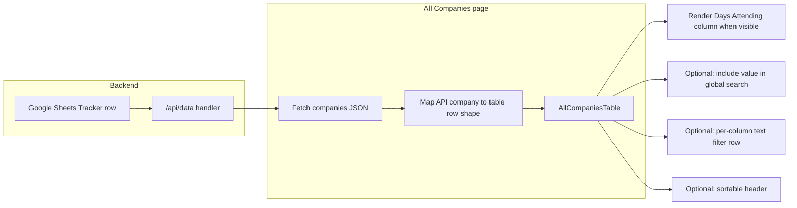

# All Companies — Days Attending Column — Implementation Plan

## 1. Feature/Task Overview

- **Purpose:** Surface each company’s **Days Attending** value on the All Companies list so committee members can scan attendance alongside status, tiers, and assignment without opening every company detail page.
- **Scope:** UI and data plumbing only. The tracker spreadsheet and `/api/data` already expose `daysAttending` from the tracker sheet; the list page currently drops that field when building the table payload and the table component has no column for it.
- **Product decision (confirmed):** The column should be **visible by default**; users may still hide it via the existing column picker and localStorage-backed visibility state.

## 2. Flow Visualization

## 3. Relevant Files

| File | Role |
|------|------|
| `outreach-tracker/pages/api/data.ts` | Already merges tracker `daysAttending` into each company; verify no change required unless range/column drift is discovered. |
| `outreach-tracker/pages/companies.tsx` | Builds `transformedCompanies` passed into the table; must forward `daysAttending` from the fetched company object. Extend the page-level `Company` type if needed so the field is typed consistently. |
| `outreach-tracker/components/AllCompaniesTable.tsx` | Defines column keys, widths, labels, defaults, visibility persistence, headers, filter row, body cells, min table width, sorting, filtering, and global search strings. All of these need to be extended in the same patterns as existing optional columns (e.g. discipline, tiers). |
| `outreach-tracker/pages/companies/[id].tsx` | Reference for label copy (“Days Attending”) and how the field is edited (free-form / comma-separated); no change required unless you choose to share a small formatting helper (optional, not required). |

## 4. References and Resources

- Internal tracker column layout (including Days Attending position): `docs/plans/2026-03-22-dual-status-split.md` (tracker column letters and `daysAttending` index notes — use only if verifying sheet alignment).
- Next.js Pages Router data flow: standard parent `useEffect` fetch → state → props to presentational table (existing All Companies pattern).

## 5. Task Breakdown

### Phase A — Data handoff from page to table

#### Task A.1 — Pass `daysAttending` through `transformedCompanies`

- **Description:** Ensure the value returned by `/api/data` reaches each row object consumed by `AllCompaniesTable`, using the same property name the detail page and API use (`daysAttending`), defaulting empty values consistently with the rest of the table (e.g. empty string).
- **Relevant files:** `outreach-tracker/pages/companies.tsx`
- **Sub-tasks:**
  - [x] Add `daysAttending` to the mapped object from the source company record.
  - [x] Update the page’s `Company` interface (or equivalent) so the field is acknowledged on the fetched shape, avoiding implicit-any drift.

### Phase B — Table column implementation

#### Task B.1 — Register the column in configuration

- **Description:** Add a new column key alongside existing keys: fixed width constant, human-readable label (“Days Attending” to match the detail page), and set **default visibility to true** per product decision. Ensure `DEFAULT_VISIBLE_COLUMNS` and the `localStorage` merge behaviour still pick up the new key for users who have saved partial column preferences (existing pattern merges saved JSON over defaults).
- **Relevant files:** `outreach-tracker/components/AllCompaniesTable.tsx`
- **Sub-tasks:**
  - [x] Extend column key union / width map / label map / default visibility map.
  - [x] Extend the table’s `Company` interface with an optional string field for days attending.

#### Task B.2 — Header, filter row, and body cell

- **Description:** Insert the column in a sensible visual order (recommendation: after **Registered Sponsorship** and before **Contact Person**, so event-related fields stay grouped). Implement header (sortable or static — implementer’s choice; if sortable, use case-insensitive string sort like other text columns). Add a filter row cell: a debounced text filter mirroring **Contact** or **Name** is enough unless you prefer multi-select of distinct day tokens (higher effort; only add if needed). Render cell text with wrapping or truncation consistent with neighbouring columns; show an em dash or “N/A” style placeholder when empty, matching nearby columns.
- **Relevant files:** `outreach-tracker/components/AllCompaniesTable.tsx`
- **Sub-tasks:**
  - [x] Add `<th>` / filter `<th>` / `<td>` blocks in the same conditional order as other toggled columns.
  - [x] Update `tableMinWidth` / `visibleColCount` logic if the codebase computes them from column flags.
  - [x] Wire filter state into `columnFilters`, `effectiveColumnFilters`, `clearAllFilters`, and `hasColumnFilters`.

#### Task B.3 — Search and sort integration

- **Description:** Include `daysAttending` in the precomputed per-row global search string so “press Enter to search” finds companies by attendance text. If the header is sortable, extend `SortField`, the sort comparator (string branch unless you define a custom order), sessionStorage persistence for `sortField`, and the `SortIcon` wiring. If an invalid `sortField` is read from sessionStorage after deploy, handle gracefully (fallback to default sort field).
- **Relevant files:** `outreach-tracker/components/AllCompaniesTable.tsx`
- **Sub-tasks:**
  - [x] Append normalized days-attending text to `companySearchStrings`.
  - [x] Extend sort types and `handleSort` / header buttons if sorting is implemented.
  - [x] Validate or normalize restored `companies_sortField` from sessionStorage when adding a new enum value.

### Dependencies

- **Phase B** depends on **Phase A** (table cannot display data that is never passed).
- **B.3** depends on **B.1** and **B.2** (sort/search need the field present and filter UI defined).

## 6. Potential Risks / Edge Cases

- **Stale sessionStorage sort key:** Users with `companies_sortField` saved in older sessions could reference an unknown value after enum changes; defensively coerce to default.
- **Long free-form text:** `daysAttending` may be comma-separated day names or free text; narrow fixed widths can clip content — prefer `break-words` / reasonable min-width over single-line truncation unless product prefers a single line with tooltip.
- **Empty vs “Registered” workflow:** Companies without tracker rows may still appear from the database; `daysAttending` may be empty — display should not break and filters should treat empty consistently.
- **Column order and colspan:** Any mismatch between header, filter, and body column conditionals causes visual misalignment; keep order identical across three rows.
- **No backend change expected:** If QA shows blank for all rows, verify tracker fetch range in `data.ts` still includes the Days Attending column for the live sheet layout (only then adjust API range/mapping).

## 7. Testing Checklist

### Column visibility and layout

- [ ] Open All Companies with cleared localStorage (or new browser profile): **Days Attending** column appears without opening the column picker.
- [ ] Toggle the column off in the picker, refresh the page: column stays hidden; turn it back on: column reappears.
- [ ] Click “Reset” in the column picker: **Days Attending** returns to **on** along with other defaults.

### Data correctness

- [ ] Pick a company that has days filled in on the **company detail** page; the same text appears in the new table column.
- [ ] Pick a company with no days set; the cell shows the chosen empty placeholder (not broken layout).

### Search and filters

- [ ] Type a substring that only appears inside **Days Attending** for one company, press Enter: global search narrows to expected rows.
- [ ] If a per-column filter exists: typing a partial match filters rows; clearing restores full list.
- [ ] “Clear filters” clears the days-attending filter along with other filters.

### Sort (if implemented)

- [ ] Click the column header twice: sort direction toggles; order changes in a sensible way for text.
- [ ] Combined with other filters: sorting still applies to the filtered subset.

### Regression

- [ ] Row click still opens company detail; checkbox selection and bulk actions unchanged.
- [ ] Horizontal scroll and sticky header still behave acceptably with the extra column.

## 8. Notes (optional)

- **Default visibility** was confirmed: show **Days Attending** by default.
- **Formatting:** Unless product asks otherwise, display the stored string as-is (same semantics as the detail page text field); optional later enhancement: split on commas and render small chips like **Discipline** badges.

## Implementation Notes (2026-05-12)

- **Implemented:** `daysAttending` is forwarded from `pages/companies.tsx` into `transformedCompanies`. `AllCompaniesTable` adds column key `daysAttending` (default **on**), placed after **Registered Sponsorship** and before **Contact Person**, with debounced text filter, sortable header (case-insensitive string sort), global search inclusion, and `coerceStoredSortField` so unknown `companies_sortField` session values fall back to default sort.
- **API:** No change to `pages/api/data.ts`; field already populated from the tracker row.
- **Not in scope:** `followUpsCompleted` is still not passed through `transformedCompanies` (pre-existing); Follow Ups column may show `0` unless addressed separately.
