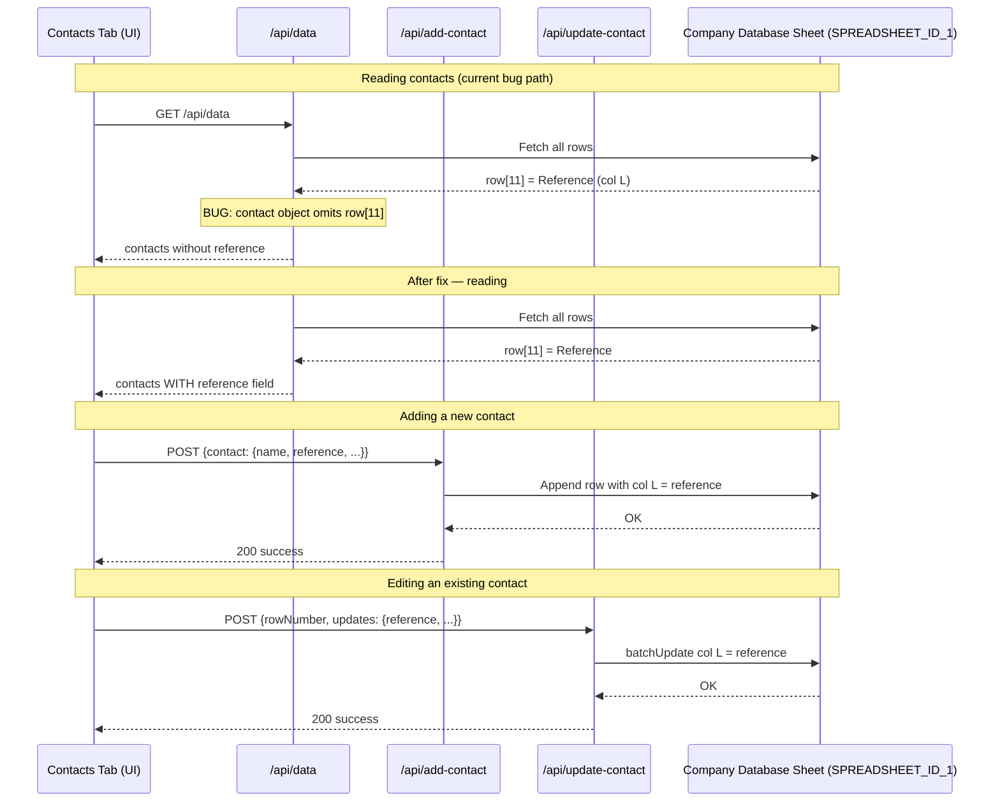

# Contact Reference Field — Implementation Plan

## Feature / Task Overview

The Company Database spreadsheet already has a **Reference** field (column L) defined to store the name of whoever referred the contact to the team (e.g., a lecturer, alumnus, or student). However, this field is currently:

- Not populated when adding or editing a contact
- Not read correctly from the sheet (wrong column index)
- Not included in the per-contact object returned by the API
- Not displayed or editable anywhere in the UI

This plan covers surfacing the Reference field **per contact** on the Contacts tab of the company detail page — fully readable, editable, and persisted to the spreadsheet.

---

## Flow Visualization

---

## Relevant Files

| File | Role |
|---|---|
| `outreach-tracker/pages/api/data.ts` | Reads both sheets and joins them. Builds the `contacts` array per company. Currently omits `reference` from each contact object and has a wrong index on the company-level field. |
| `outreach-tracker/pages/api/add-contact.ts` | Appends a new contact row. Column L placeholder is hardcoded to `''` — needs to accept `contact.reference` from the request body. |
| `outreach-tracker/pages/api/update-contact.ts` | Updates individual contact fields via `CONTACT_COL_MAP`. Column L (`reference`) is not yet in the map. |
| `outreach-tracker/pages/companies/[id].tsx` | Main company detail page. Hosts the Contacts tab with inline add/edit forms and contact cards. `Contact` interface and `newContact` state need `reference`. |

---

## References and Resources

- [Schema Documentation](/docs/schema_documentation.md) — Column L is `Reference`, index 11, type String
- [Company Database Columns](/docs/plans/company_database_columns.md) — Confirms column order

---

## Task Breakdown

## Phase 1 — Data Layer Fix

### Task 1.1: Fix the contact read in `data.ts`

**Description:** The `contacts.push(...)` block in the database row loop does not include `reference`. Also, the company-level `reference: row[10]` is reading the LinkedIn column (index 10) instead of the correct Reference column (index 11).

**Relevant files:** `outreach-tracker/pages/api/data.ts`

- [x] Add `reference: row[11]` inside the `contacts.push({...})` object, following the same pattern as `linkedin`, `remark`, etc.
- [x] Fix the company-level mapping from `reference: row[10]` to `reference: row[11]` to correct the existing bug (even though this field is not currently displayed, keeping it correct prevents future confusion).

**Dependencies:** None.

---

## Phase 2 — API Write Layer

### Task 2.1: Accept and persist reference on contact creation

**Description:** `add-contact.ts` always writes an empty string for column L. It needs to read `contact.reference` from the incoming request body and write it to the row.

**Relevant files:** `outreach-tracker/pages/api/add-contact.ts`

- [x] Replace the hardcoded `''` placeholder for column L with `contact.reference?.trim() || ''`.
- [x] No changes needed to the request body destructuring, as `contact` is already forwarded as an object — the new field just needs to be read from it.

**Dependencies:** None.

### Task 2.2: Support reference updates in the update API

**Description:** `update-contact.ts` uses a `CONTACT_COL_MAP` dictionary to map field names to sheet columns. Reference is not in this map, so it can never be updated.

**Relevant files:** `outreach-tracker/pages/api/update-contact.ts`

- [x] Add `'reference': 'L'` to the `CONTACT_COL_MAP` dictionary.

**Dependencies:** None.

---

## Phase 3 — UI Layer

### Task 3.1: Extend TypeScript types and state

**Description:** The `Contact` interface and the `newContact` state object in the detail page need to include `reference` so it flows through the component.

**Relevant files:** `outreach-tracker/pages/companies/[id].tsx`

- [x] Add `reference?: string` to the `Contact` interface.
- [x] Add `reference: ''` to the initial value of `newContact` state (the `useState` initialiser).
- [x] Add `reference: ''` to every place where `newContact` is reset (after save, after cancel) — there are several such resets in the file; search for `setNewContact({` to find them all.
- [x] In `startEditingContact`, populate `reference: contact.reference || ''` alongside the other fields.

**Dependencies:** Phase 1 must be complete so the field arrives from the API.

### Task 3.2: Add Reference input to the add/edit inline form

**Description:** The inline contact form (shown when `showAddContact` is true) has inputs for Name, Role, Phone, Email, LinkedIn, and Remarks. A Reference input should be added.

**Relevant files:** `outreach-tracker/pages/companies/[id].tsx`

- [x] Add a text input for Reference, placed logically after the LinkedIn URL input and before (or alongside) the Remarks textarea.
- [x] Use the placeholder `"Referred by (e.g. Dr. Ahmad)"` or similar to communicate intent.
- [x] Wire `value` to `newContact.reference` and `onChange` to update the state (same pattern as other fields).

**Dependencies:** Task 3.1.

### Task 3.3: Display Reference on contact cards (view mode)

**Description:** Each contact card in the Contacts tab renders the contact's name, role, phone, email, LinkedIn, and remark. Reference should also appear here when present.

**Relevant files:** `outreach-tracker/pages/companies/[id].tsx`

- [x] In the contact card render block, conditionally render a small labelled line (e.g. `Referred by: Prof. Smith`) when `contact.reference` is non-empty.
- [x] Style it consistently with the existing `contact.remark` display (small, muted text). A label prefix like "Ref:" or "Referred by:" helps scanability.
- [x] Optionally make it copyable (same `handleCopyContactField` pattern used for phone, email, etc.).

**Dependencies:** Task 3.1.

### Task 3.4: Include Reference in the contact update diff log

**Description:** When saving an edited contact, the code builds a `changes` array for the activity log. Reference edits should be tracked there too.

**Relevant files:** `outreach-tracker/pages/companies/[id].tsx`

- [x] In the section that builds the `changes` array for contact updates (look for the block that checks `updates.linkedin`, `updates.remark`, etc.), add a comparable check for `updates.reference` and push a `Reference: old → new` entry when it changes.
- [x] Pass `reference: newContact.reference` in the updates object sent to `handleUpdateContact`.

**Dependencies:** Task 3.1, Task 3.2.

---

## Potential Risks / Edge Cases

- **Multiple contacts sharing a company:** Each contact row has its own Reference cell. Users may set different referrers per contact, which is valid. The display should not aggregate or deduplicate — each card is independent.
- **Existing rows with no reference value:** Most existing contacts will have an empty column L. The UI must gracefully hide the field when it is empty (already handled by a conditional render check).
- **Company-level `reference` field:** The company object currently exposes a (incorrectly indexed) `reference` field. After the fix it will read correctly from the first contact row. No UI currently renders this, but it could cause confusion if a developer assumes it represents the company-wide referrer. A code comment should clarify it is simply the reference from the first DB row for that company.
- **`hasContactInfo` row filter in `data.ts`:** Line 216 checks columns F, H, I, K (name, email, phone, linkedin) to decide if a row is a real contact. A row that has only a Reference value and nothing else will not be treated as a contact — this is correct behaviour and does not need changing.

---

## Testing Checklist

### Viewing Contacts
- [ ] Open a company that has at least one contact with a pre-existing Reference value in the spreadsheet — the Reference should appear on the contact card.
- [ ] Open a company whose contacts have no Reference value — no reference line should appear on any contact card (graceful empty state).

### Adding a Contact
- [ ] Open the Add Contact form — a "Referred by" input is present.
- [ ] Fill in the Reference field and save — the new contact row in the spreadsheet has the correct value in column L.
- [ ] After adding, the contact card in the UI shows the entered reference.
- [ ] Leave the Reference field blank and save — the contact is added successfully with no reference displayed.

### Editing a Contact
- [ ] Click edit on an existing contact that has a Reference — the Reference field is pre-filled with the current value.
- [ ] Change the Reference value and save — the spreadsheet column L is updated and the contact card reflects the new value.
- [ ] Clear the Reference field and save — the contact card no longer shows a reference line.
- [ ] The activity history log shows a `Reference: old → new` entry when reference is changed.

### Regression
- [ ] Adding a contact without a Reference still works correctly.
- [ ] LinkedIn URL field is still correctly displayed and persisted (verifies the index-11 fix did not accidentally shift anything).
- [ ] Other contact fields (name, role, phone, email, remark, isActive) are unaffected by the changes.

---

## Notes

- The `reference` field is a free-text string. No validation or dropdown is needed — referrers can be any person (lecturer, student, alumnus, etc.).
- Do not add Reference to the Add Company modal per user preference; it is only editable through the Contacts tab after a company is created.
- When writing the history log entry for a new contact that includes a reference, consider whether to include it in the `historyLog` string sent to `add-contact.ts` (e.g. `[Contact Added]: Jane Doe (Procurement Manager) — Ref: Prof. Smith`). This is optional but improves auditability.

---

## Implementation Notes

- **Completed:** Phases 1–3 implemented across `data.ts`, `add-contact.ts`, `update-contact.ts`, and `companies/[id].tsx`.
- **UI location:** Company detail page → **Contacts** tab → inline add/edit form (field after LinkedIn) and contact card view (`Referred by:` line when set).
- **Add Company modal:** Intentionally excluded per product decision.
- **History log:** New contacts with a reference append `— Ref: …` to the Thread_History entry.
- **Company-level `reference`:** Still populated from the first DB row for that company (`row[11]`); not shown in the UI — only per-contact reference is surfaced.
- **Manual verification:** Run through the Testing Checklist in this plan against a dev/staging sheet after deploy.
