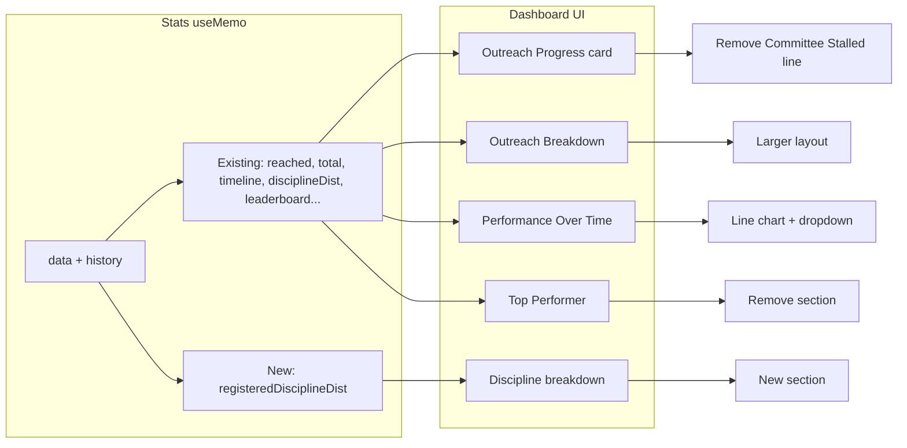
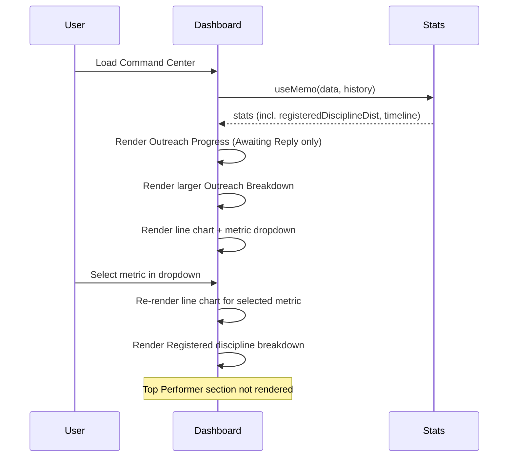

# Dashboard Changes Implementation Plan

## 1. Feature/Task Overview

Update the Command Center dashboard (main landing page for authenticated users) with the following changes:

- **Outreach Progress card**: Stop showing "Committee Stalled"; keep only "Awaiting Reply".
- **Outreach Breakdown**: Increase its visual size/prominence.
- **Outreach Performance Over Time**: Replace the current stacked bar chart with a line chart and add a dropdown so users can choose which metric to display (e.g. Contacted, Interested, or Registered).
- **New**: Add a "Registered companies discipline breakdown" section to the dashboard (discipline distribution for companies with status = Registered only).
- **Remove from dashboard**: The "Top Performance" / leaderboard mini section. The leaderboard remains available on the **Analytics** page (Committee Leaderboard) so users can still view top performers there.

Scope is the main dashboard at `pages/index.tsx` (Command Center). The analytics page (`pages/analytics.tsx`) already contains a full Committee Leaderboard; applying other dashboard UX changes there for consistency is optional and can be done in a follow-up.

---

## 2. Flow Visualization

---

## 3. Relevant Files

| File | Role |
|------|------|
| `outreach-tracker/pages/index.tsx` | Main dashboard (Command Center). Contains Outreach Progress card, Outreach Breakdown, Outreach Performance Over Time, distributions, Top Performance block, and layout. All requested changes are implemented here. |
| `outreach-tracker/lib/discipline-mapping.ts` | Provides `disciplineToDisplay()` (and options). Use when rendering discipline labels so abbreviations from the database are shown as full names in the new Registered discipline breakdown. |
| `outreach-tracker/pages/api/data.ts` | Supplies `companies` and `history`. Companies include `status`, `discipline`; history drives timeline. No API changes required. |
| `outreach-tracker/pages/analytics.tsx` | Analytics page with similar sections (Outreach Progress, Outreach Breakdown, Performance Over Time, Disciplines) and the **Committee Leaderboard** (top performers). This is where users will find the leaderboard after it is removed from the dashboard. Optional: apply same UX changes here for consistency. |

---

## 4. References and Resources

- Existing timeline structure in `index.tsx`: cumulative series `{ date, contacted, interested, registered }` over the last 30 days; reuse for line chart with one series selected.
- Discipline display: `lib/discipline-mapping.ts` — use `disciplineToDisplay(dbValue)` for any key that may be stored as abbreviation (e.g. `CHE`, `MEC`).
- Chart implementation: No chart library is currently used for the dashboard; the current “Performance Over Time” is built with divs and inline styles. Implementing a line graph can be done with CSS/SVG or by introducing a small chart library (e.g. Recharts, Chart.js, or lightweight SVG) per project preferences.

---

## 5. Task Breakdown

### Phase 1: Outreach Progress card and Outreach Breakdown

#### Task 1.1: Outreach Progress — show only Awaiting Reply
- **Description**: In the Outreach Progress card, remove the “Committee Stalled” count and its label; keep only “Awaiting Reply” (and the main gauge / reached total).
- **Relevant files**: `outreach-tracker/pages/index.tsx`
- **Sub-tasks**:
  - [ ] Remove the line or block that displays Committee Stalled (e.g. the div with `stats.committeeStalledCount` and “Committee Stalled” text).
  - [ ] Keep the gauge, reached/total, and the “Awaiting Reply” line unchanged.
  - [ ] Optionally remove or leave unused the `committeeStalledCount` computation in `stats` useMemo; removing it is a small cleanup if nothing else references it.

#### Task 1.2: Make Outreach Breakdown larger
- **Description**: Increase the size/prominence of the Outreach Breakdown card (e.g. give it more grid span, a dedicated row, or larger typography and bar height).
- **Relevant files**: `outreach-tracker/pages/index.tsx`
- **Sub-tasks**:
  - [ ] Adjust layout so Outreach Breakdown has more space (e.g. change grid from 4 columns to a layout where Outreach Breakdown spans more columns or sits in a wider row).
  - [ ] Optionally increase bar height, font size, and padding so the card feels “larger” visually.

---

### Phase 2: Outreach Performance Over Time — line chart and dropdown

#### Task 2.1: Add metric selection state and dropdown
- **Description**: Add local state for the selected timeline metric (e.g. `contacted` | `interested` | `registered`) and a dropdown in the “Outreach Performance Over Time” section to switch between them.
- **Relevant files**: `outreach-tracker/pages/index.tsx`
- **Sub-tasks**:
  - [ ] Add state (e.g. `performanceMetric`) with a default (e.g. `'contacted'`).
  - [ ] Render a dropdown (native `<select>` or existing UI component) with options: Contacted, Interested, Registered.
  - [ ] Place the dropdown near the section title or legend so it’s clear it controls the chart.

#### Task 2.2: Replace bar chart with line graph
- **Description**: Replace the current stacked vertical bar chart with a line graph that plots the selected metric over time (using existing `stats.timeline`).
- **Relevant files**: `outreach-tracker/pages/index.tsx`
- **Sub-tasks**:
  - [ ] Implement a line chart that uses `stats.timeline` and the selected metric (contacted, interested, or registered).
  - [ ] Use SVG or a small chart library to draw the line; keep styling consistent with the rest of the dashboard (e.g. single line, clear axis labels for dates and values).
  - [ ] Ensure the chart updates when the user changes the dropdown selection.
  - [ ] Optionally add a simple tooltip or hover state for the selected series (e.g. date + value).

---

### Phase 3: Registered companies discipline breakdown and remove Top Performer

#### Task 3.1: Add Registered discipline distribution and new section
- **Description**: Compute discipline distribution only for companies with `status === 'Registered'` and add a new dashboard section that shows this “Registered companies discipline breakdown”.
- **Relevant files**: `outreach-tracker/pages/index.tsx`, `outreach-tracker/lib/discipline-mapping.ts`
- **Sub-tasks**:
  - [ ] In the `stats` useMemo, add a `registeredDisciplineDist` (or similar) object built by iterating only over companies where `c.status === 'Registered'` and aggregating by `c.discipline` (handle comma-separated values the same way as existing `disciplineDist`).
  - [ ] Add a new card/section in the dashboard (e.g. in the distributions row or right column) titled appropriately (e.g. “Registered companies by discipline”).
  - [ ] Render the breakdown (e.g. list or horizontal bars) using `registeredDisciplineDist`; use `disciplineToDisplay()` for labels so abbreviations show as full names.
  - [ ] Handle empty state when there are no registered companies or no disciplines.

#### Task 3.2: Remove Top Performer from dashboard (keep on Analytics)
- **Description**: Remove the “Top Performance” / “Ranking Mini” block from the dashboard only. The leaderboard stays on the Analytics page (Committee Leaderboard) so users can still view top performers via "View Detailed Analytics" or the analytics route.
- **Relevant files**: `outreach-tracker/pages/index.tsx`
- **Sub-tasks**:
  - [ ] Remove the entire block that renders “Top Performance” and the leaderboard slice (e.g. the div with TrophyIcon and `stats.leaderboard.slice(0, 3)`).
  - [ ] Ensure the dashboard still links to Analytics (e.g. "View Detailed Analytics →" in Active Members or nav) so users can find the leaderboard there.
  - [ ] Remove `leaderboard` from the dashboard's stats useMemo only if nothing else on the dashboard needs it; otherwise leave it for cleanup.

---

### Dependencies

- Phase 1 can be done independently.
- Phase 2 depends only on existing `stats.timeline` and layout; can be done in parallel with Phase 1 or 3.
- Phase 3 (Registered discipline + remove Top Performer) can be done independently; Task 3.1 depends on `discipline-mapping` for display labels.

---

## 6. Potential Risks / Edge Cases

- **Discipline format**: Companies may have `discipline` as comma-separated abbreviations or mixed formats. Reuse the same parsing logic as existing `disciplineDist` (split by comma, trim) and use `disciplineToDisplay()` when rendering to avoid broken or cryptic labels.
- **Empty states**: If there are no registered companies, `registeredDisciplineDist` will be empty; show a clear empty state (e.g. “No registered companies yet” or “No discipline data”) instead of an empty card.
- **Line chart library**: If a chart library is introduced, ensure it’s already a project dependency or add it; prefer a small, maintainable option to avoid bundle bloat.
- **Leaderboard location**: The top performer / leaderboard is intentionally on the **Analytics** page only (Committee Leaderboard). Do not remove it from analytics when removing the dashboard mini. Ensure the dashboard has a clear link to Analytics so users can find the leaderboard.
- **Analytics parity**: If the same UX changes (Progress card, larger Breakdown, line chart + dropdown, Registered discipline) are later applied to `analytics.tsx`, keep the Committee Leaderboard section on the analytics page.

---

## 7. Testing Checklist

### Outreach Progress card
- [ ] Dashboard loads; Outreach Progress card shows the circular gauge and “reached / total”.
- [ ] “Awaiting Reply” count is still visible and correct.
- [ ] “Committee Stalled” count and label are no longer shown.

### Outreach Breakdown
- [ ] Outreach Breakdown section is visibly larger (more space or bigger elements) than before.
- [ ] Registered, Interested, and No Reply bars/percentages still match the data.

### Outreach Performance Over Time
- [ ] The section shows a line graph (not stacked bars) over the last 30 days.
- [ ] A dropdown allows choosing Contacted, Interested, or Registered.
- [ ] Changing the dropdown updates the line to the selected metric; values and scale look correct.
- [ ] Date range (e.g. first and last date) is still visible; no console errors.

### Registered companies discipline breakdown
- [ ] A new section appears (e.g. “Registered companies by discipline”).
- [ ] Only companies with status “Registered” are included in the breakdown.
- [ ] Discipline labels are readable (full names, not raw abbreviations) when mapping is used.
- [ ] When there are no registered companies (or no discipline data), an appropriate empty state is shown.

### Top Performer / Leaderboard
- [ ] The “Top Performance” / “Ranking Mini” block is no longer visible on the dashboard.
- [ ] The Analytics page still shows the Committee Leaderboard (top performers); the link from the dashboard to Analytics (e.g. "View Detailed Analytics →") is present so users can find the leaderboard.
- [ ] Rest of the dashboard (Active Members, Flagged, links) still works and layout is intact.

### General
- [ ] Refresh Stats still loads data and all updated sections update accordingly.
- [ ] No layout break on small viewports; responsive behavior is acceptable.

---

## 8. Notes

- **Analytics page**: `pages/analytics.tsx` has its own Outreach Progress, Outreach Breakdown, and Outreach Performance Over Time. This plan does not require changing analytics; if product wants the same behavior there (e.g. line chart + dropdown, Progress without Committee Stalled, larger Breakdown, Registered discipline), the same tasks can be applied to that page.
- **Data**: All required data (companies with status and discipline, history for timeline) already comes from `/api/data`; no new API endpoints are required.
- **Chart choice**: If the team prefers to avoid a new dependency, a simple SVG-based line (e.g. `<svg>` with `<polyline>` or `<path>` from timeline points) is sufficient for a single metric; the dropdown only switches which series is drawn.
