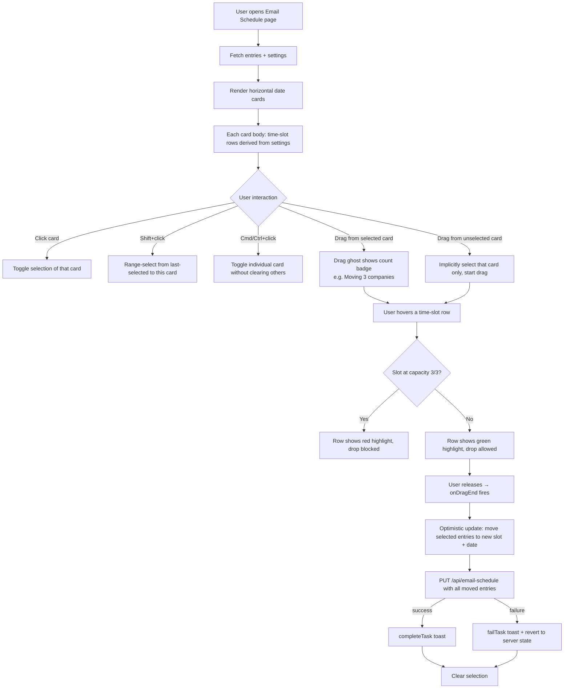

# Email Schedule Grid — Implementation Plan

## Feature Overview

Redesign the **Email Schedule page** to show time-bucket rows inside each existing date card (Option C). Within each card, instead of a flat list of companies, the body is divided into explicit 15-min slot rows. Each row is a droppable target. Company cards are draggable items. Multiple companies can be selected (click, Shift+click, Cmd/Ctrl+click) and dragged together as a batch to a different time slot within the same date card, or across date cards.

Existing functionality (inline edit, delete, settings panel, date navigation, optimistic updates via BackgroundTasksContext) is preserved. The inline edit form is removed in favour of drag-to-reschedule.

---

## Flow Visualization

---

## Relevant Files

| File | Role |
|---|---|
| `pages/email-schedule.tsx` | Main page — entirely reworked UI; date card layout, selection state, drag-and-drop wiring |
| `lib/schedule-calculator.ts` | `timeToMinutes`, `minutesToTime`, `isInBlockedPeriod`, `skipBlockedPeriods`, `formatTime` — used to generate the ordered time-slot list shown as row labels |
| `lib/email-schedule.ts` | Data layer; `getEmailSchedule`, `saveEmailScheduleEntries` — backend reads/writes unchanged |
| `pages/api/email-schedule/index.ts` | PUT handler — receives batch of moved entries; no changes needed |
| `contexts/BackgroundTasksContext.tsx` | `addTask`, `completeTask`, `failTask` — used for optimistic update feedback |
| `package.json` | New dependency: `@dnd-kit/core` and `@dnd-kit/utilities` |

---

## References and Resources

- [@dnd-kit/core docs — useDraggable](https://docs.dndkit.com/api-documentation/draggable)
- [@dnd-kit/core docs — useDroppable](https://docs.dndkit.com/api-documentation/droppable)
- [@dnd-kit/core docs — DragOverlay](https://docs.dndkit.com/api-documentation/draggable/drag-overlay)
- [@dnd-kit/core docs — DndContext & sensors](https://docs.dndkit.com/api-documentation/context-provider)
- [Multi-drag pattern reference (rbd)](https://github.com/atlassian/react-beautiful-dnd/blob/master/docs/patterns/multi-drag.md)
- [Existing PUT API — `pages/api/email-schedule/index.ts`]

---

## Phase 1 — Dependency + Time-Slot Row Generation

### Install @dnd-kit

**Description:** Add `@dnd-kit/core` and `@dnd-kit/utilities` to the project.

**Relevant files:** `package.json`

- [ ] Run `npm install @dnd-kit/core @dnd-kit/utilities` and verify it installs cleanly alongside React 19

### Build the time-slot row list

**Description:** Derive the ordered, non-blocked list of time slots to show as rows inside each date card. This is pure client-side logic using existing `schedule-calculator` helpers — no new API calls.

**Relevant files:** `pages/email-schedule.tsx`, `lib/schedule-calculator.ts`

- [ ] Write a helper (e.g. `getVisibleTimeSlots(settings)`) that generates every slot from `defaultStartTime` through the latest scheduled entry on any day (or a sensible cap like 18:00), stepping by `batchIntervalMinutes`, skipping blocked periods
- [ ] A "blocked" slot row should still render but be visually distinct (greyed out, no-drop indicator)
- [ ] Only render time slots that have at least one scheduled entry on at least one visible date, plus one empty slot above and below for drop targets — avoids an overwhelming wall of empty rows

**Dependencies:** Settings must be loaded before slot rows can be computed.

---

## Phase 2 — Time-Bucket Row Layout (no drag yet)

### Restructure date card body

**Description:** Replace the current flat list (companies grouped by PIC) with an explicit list of time-slot rows. Each row contains a time label on the left and up to 3 company chip cards on the right.

**Relevant files:** `pages/email-schedule.tsx`

- [ ] Each date card body iterates over `visibleTimeSlots`; for each slot, filter entries where `entry.date === card.date && entry.time === slot`
- [ ] The company chip shows: company name (truncated), PIC badge (small coloured tag), and a subtle drag handle icon
- [ ] Blocked slot rows render with a striped/grey background and tooltip explaining why they are blocked (e.g. "Lunch break")
- [ ] A slot at capacity (3 companies) shows a subtle "Full" pill in the row label
- [ ] Empty rows show a faint placeholder ("Drop here")
- [ ] Card height grows with content; the card itself scrolls vertically if needed (existing `max-h` + `overflow-y-auto` pattern)

---

## Phase 3 — Multi-Select

### Selection state and keyboard modifiers

**Description:** Add `selectedIds: Set<string>` and `lastSelectedId: string | null` to page state. Company IDs are used as selection keys. Selection is scoped globally across all date cards (you can select companies from different dates simultaneously, which enables cross-date drag).

**Relevant files:** `pages/email-schedule.tsx`

- [ ] **Plain click** on a company chip → clear selection, select only that chip
- [ ] **Shift+click** → range-select: collect all chips in document order (sorted by date, then time slot, then order within slot) from the last-selected chip to the clicked chip
- [ ] **Cmd/Ctrl+click** → toggle selection of that chip without clearing others
- [ ] Selected chips render with an indigo ring and a checkmark overlay in the top-right corner
- [ ] A floating selection count badge appears at the bottom of the page when 2+ chips are selected (e.g. "3 companies selected — drag to reschedule · ESC to clear")
- [ ] `Escape` key clears the entire selection

---

## Phase 4 — Drag and Drop

### DndContext setup

**Description:** Wrap the date cards container in a single `DndContext`. Use `PointerSensor` with a small activation distance (e.g. 5px) so a click doesn't accidentally trigger a drag.

**Relevant files:** `pages/email-schedule.tsx`

- [ ] Wrap the horizontal cards container in `<DndContext>` with `PointerSensor` configured
- [ ] Track `activeId: string | null` (the company ID on which the drag was initiated)
- [ ] On `onDragStart`: if the dragged chip is not in `selectedIds`, implicitly select only that chip (replace selection)
- [ ] On `onDragEnd`: read the `over` droppable ID (format: `"date:YYYY-MM-DD|time:HH:mm"`), compute the new assignment, fire the update

### Draggable company chips

**Description:** Each company chip uses `useDraggable`. The entire chip is the drag handle (no separate handle element needed given the small card size). Apply `touch-action: none` via inline style.

**Relevant files:** `pages/email-schedule.tsx`

- [ ] Each chip's draggable ID is its `companyId` (globally unique)
- [ ] While dragging, the original chip position goes semi-transparent (opacity 30%) to indicate it is being moved
- [ ] If the chip is part of a multi-selection, all selected chips go semi-transparent when any one of them is dragged

### Droppable time-slot rows

**Description:** Each time-slot row within each date card is a `useDroppable` zone. Droppable ID encodes both date and time so the drop handler knows exactly where to move the entries.

**Relevant files:** `pages/email-schedule.tsx`

- [ ] Droppable ID format: `"YYYY-MM-DD|HH:mm"` (pipe-separated, easy to parse)
- [ ] When the drag is active and hovering a droppable row:
  - Row with capacity remaining → green highlight border
  - Row that would overflow (current count + dragging count > `emailsPerBatch`) → amber warning highlight; drop is still allowed but the system packs the overflow into the next available slot (reuse `computeTimeSlotsWithExisting` logic client-side)
  - Blocked period row → red highlight; drop is blocked (set `disabled: true` on `useDroppable` for blocked rows)
- [ ] Empty date card bodies also function as droppable targets (drop assigns the first available slot for that date)

### DragOverlay ghost

**Description:** A floating ghost element follows the cursor during drag. It shows how many companies are being moved.

**Relevant files:** `pages/email-schedule.tsx`

- [ ] When 1 company is dragged: ghost looks like the chip itself
- [ ] When N > 1 companies are dragged: ghost shows the first company name with a `+N-1 more` badge
- [ ] Ghost has a subtle drop-shadow and 90% opacity to distinguish it from the canvas

### onDragEnd handler and optimistic update

**Description:** When the user drops onto a valid target, immediately update local state and fire the PUT API in the background using the existing BackgroundTasksContext pattern.

**Relevant files:** `pages/email-schedule.tsx`, `pages/api/email-schedule/index.ts`

- [ ] Parse the droppable ID to get `targetDate` and `targetTime`
- [ ] For each selected entry, compute the new time: use the same slot-occupancy logic as `computeTimeSlotsWithExisting` but client-side (occupancy map from current `entries` state, minus the entries being moved, plus the drop target slot)
- [ ] Optimistically update `entries` state
- [ ] Call `PUT /api/email-schedule` with all moved entries as a batch
- [ ] On success: `completeTask`, refresh entries silently
- [ ] On failure: `failTask`, call `fetchEntries()` to revert
- [ ] Clear selection after a successful drop

**Dependencies:** Phase 3 (selection) must be complete before multi-drag makes sense.

---

## Phase 5 — Polish

### Remove inline edit form

**Description:** The current pencil-icon inline edit form (time picker, date picker, PIC dropdown) is replaced by drag-to-reschedule. PIC changes are still needed; simplify to a small popover or a right-click context menu with "Change PIC" option.

**Relevant files:** `pages/email-schedule.tsx`

- [ ] Remove `editingEntry`, `editTime`, `editDate`, `editPic` state and the edit form UI
- [ ] Keep the delete (trash) button on each chip, shown on hover
- [ ] Add a "Change PIC" action on each chip (e.g. a small dropdown that appears on hover alongside the delete button)

### Scroll behaviour

**Description:** The horizontal scroll container for date cards should still work smoothly. Dragging near the left/right edges should not accidentally scroll the container (the existing date navigation arrows handle scrolling).

**Relevant files:** `pages/email-schedule.tsx`

- [ ] Ensure the `DndContext` `PointerSensor`'s activation constraint prevents scroll interference
- [ ] Set `touch-action: none` on each draggable chip

---

## Potential Risks / Edge Cases

| Risk | Mitigation |
|---|---|
| Dropping N chips onto a slot with only 1 space left | Client-side occupancy map packs overflow into subsequent slots; visual warning (amber) before drop informs user |
| Dragging a chip from date A to date B when the chip's `companyId|date` key is used for matching | The PUT payload sends both old and new date; `saveEmailScheduleEntries` upserts by `companyId|date` — the old row must be cleared first (delete then save), or the API needs to handle key changes |
| `@dnd-kit/core` vs React 19 compatibility | Verify peer deps after `npm install`; @dnd-kit/core 6.x is compatible with React 18/19 |
| Blocked period rows should not be droppable | `useDroppable` supports a `disabled` prop — set it for blocked rows |
| Very long company names overflow the chip | Use `truncate` on the name span; full name shown in the existing tooltip-on-hover pattern |
| Cross-date multi-drag: selected chips on different dates all move to the new target date | Confirm this is the desired behaviour; if not, restrict drag to same-date-only in Phase 4 |
| Mobile / touch events | `PointerSensor` handles touch; set `touch-action: none` on chips |

---

## Testing Checklist

### Layout
- [ ] Each date card shows time-slot rows (not a flat list) sorted chronologically
- [ ] Blocked periods (lunch, after-hours) show greyed-out rows and are not droppable
- [ ] Slots at capacity (3 companies) show a "Full" indicator in the row label
- [ ] Empty slots show a faint "Drop here" placeholder
- [ ] Today's card is highlighted (existing indigo ring)

### Selection
- [ ] Clicking a company chip selects it (indigo ring + checkmark)
- [ ] Clicking a different chip deselects the first and selects the new one
- [ ] Shift+clicking selects a contiguous range
- [ ] Cmd/Ctrl+clicking toggles individual chips without clearing the rest
- [ ] Pressing Escape clears all selections
- [ ] The floating badge shows the correct count when 2+ are selected

### Drag — Single company
- [ ] Dragging a chip shows a ghost that looks like the chip
- [ ] The original chip goes semi-transparent while being dragged
- [ ] Hovering a valid slot shows a green highlight
- [ ] Releasing on a valid slot moves the company there (optimistic update visible immediately)
- [ ] Releasing on a full slot shows an amber warning before drop and packs overflow into the next slot
- [ ] Releasing on a blocked slot is prevented (no visual change on release)
- [ ] Dragging between date cards moves the company to the correct new date

### Drag — Multi-select
- [ ] Dragging from a selected chip shows a ghost with "+N-1 more" badge
- [ ] All selected chips go semi-transparent during the drag
- [ ] Releasing drops all selected companies at the target time slot (packing into subsequent slots if needed)
- [ ] Selection is cleared after a successful drop

### Persistence
- [ ] After a drop, the schedule page reflects the new assignment after a silent refresh
- [ ] After a drop, the All Companies table (if Schedule column is visible) reflects the new time on next load
- [ ] If the API call fails, the page reverts to the pre-drag state and shows an error toast

### Delete
- [ ] Hovering a chip shows the delete icon
- [ ] Clicking delete opens the confirm modal
- [ ] Confirming removes the company from the schedule

### Change PIC
- [ ] Hovering a chip shows the "Change PIC" action
- [ ] Selecting a new PIC updates the chip immediately (optimistic) and persists to the sheet

### Settings
- [ ] The Settings panel still opens/closes correctly
- [ ] Changing `batchIntervalMinutes` updates the visible time-slot row intervals after save
