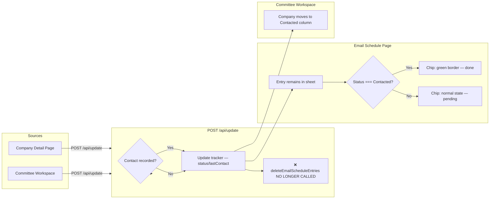
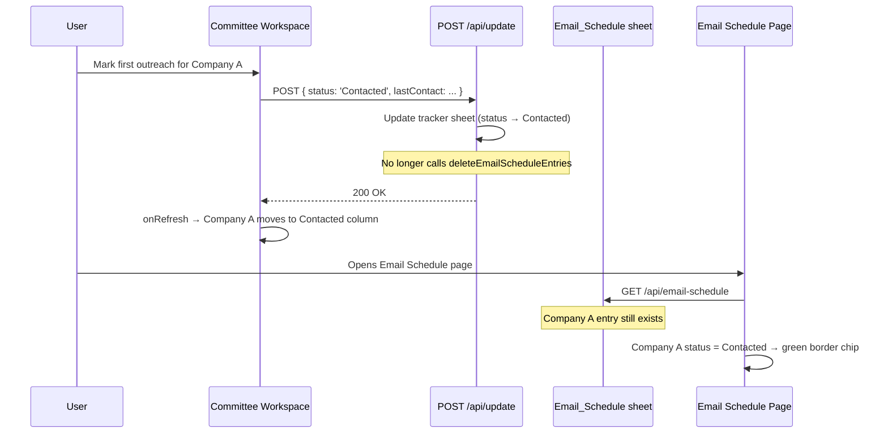

# Email Schedule: Persistent Day Schedule — Implementation Plan

## 1. Feature/Task Overview

**Current problem:** When contact is logged for a company (from anywhere), the backend automatically removes the company from the Email_Schedule sheet. This causes companies to disappear from the Email Schedule page as soon as any contact action is recorded.

**Desired behaviour:**
- **Email Schedule page:** Companies always remain on the day schedule — entries are never auto-deleted when contact is logged. Once a company has been contacted (status is `Contacted` or has a `lastContact`), its chip turns green-bordered to indicate the outreach was completed.
- **Committee workspace:** No behaviour change. When first outreach or follow-up is logged, the company's status changes to `Contacted` and it moves to the "Contacted" column — as it does today. The schedule entry is no longer auto-deleted.
- **Company detail page:** The email schedule date/time badge (in the header) and the "Scheduled: … at …" display text (in the admin panel) are removed. Admins schedule emails from the Email Schedule page directly.

---

## 2. Flow Visualization

---

## 3. Relevant Files

| File | Role |
|------|------|
| `outreach-tracker/pages/api/update.ts` | Remove the automatic call to `deleteEmailScheduleEntriesForCompanies` when contact is recorded — the core backend fix. |
| `outreach-tracker/pages/email-schedule.tsx` | (1) Include `status` in `CompanyAssignment` from `/api/data`; (2) Pass `isContacted` to `ScheduleChip`; (3) Render a green-bordered chip for contacted companies. |
| `outreach-tracker/pages/companies/[id].tsx` | Remove the scheduled date/time badge in the header and the "Scheduled: … at …" display text in the admin panel. The date/time inputs and Set/Clear button can remain if useful; the displayed values are removed. |
| `outreach-tracker/lib/email-schedule.ts` | No changes needed — `deleteEmailScheduleEntriesForCompanies` is untouched (still used for manual bulk-delete from the Email Schedule page). |
| `outreach-tracker/components/committee-workspace.tsx` | No changes needed — status updates already move companies to Contacted column. |
| `outreach-tracker/pages/committee.tsx` | No changes needed — data is re-fetched after committee actions; company status drives the column placement. |

---

## 4. References and Resources

- Auto-delete logic to remove: `outreach-tracker/pages/api/update.ts` lines 200–207.
- `ScheduleChip` component (chip rendering): `outreach-tracker/pages/email-schedule.tsx` lines 243–294.
- `CompanyAssignment` interface: `outreach-tracker/pages/email-schedule.tsx` lines 59–63.
- `fetchEntries` (also fetches `/api/data`): `outreach-tracker/pages/email-schedule.tsx` lines 391–437.
- Header badge on company detail: `outreach-tracker/pages/companies/[id].tsx` lines 1223–1228.
- Admin "Outreach schedule" section: `outreach-tracker/pages/companies/[id].tsx` lines 1512–1590.

---

## 5. Task Breakdown

### Phase 1: Stop auto-deleting schedule entries on contact

#### 1.1 Remove auto-delete from update API

- **Description:** Remove the block in the update handler that calls `deleteEmailScheduleEntriesForCompanies`. Entries in the Email_Schedule sheet should only be removed by explicit admin action (manual delete on the Email Schedule page).
- **Relevant files:** `outreach-tracker/pages/api/update.ts`
- [ ] Delete the `recordedContact` check and the `deleteEmailScheduleEntriesForCompanies([companyId])` call (approximately lines 200–207).
- [ ] Ensure the `deleteEmailScheduleEntriesForCompanies` import is removed if it is no longer used anywhere else in this file.
- [ ] Verify no other auto-delete triggers exist in the update handler.

#### Dependencies

- None. This is the foundational change everything else builds on.

---

### Phase 2: Show "contacted" visual state on Email Schedule page chips

#### 2.1 Include company status in `allAssignments`

- **Description:** The Email Schedule page already fetches `/api/data` to build `allAssignments`. Extend `CompanyAssignment` to include `status` so chips can determine if a company has been contacted.
- **Relevant files:** `outreach-tracker/pages/email-schedule.tsx`
- [ ] Add `status: string` to the `CompanyAssignment` interface.
- [ ] In `fetchEntries`, map `c.status` (from the data API response) into each `CompanyAssignment` object.

#### 2.2 Derive contacted state per entry and pass to chip

- **Description:** When building the display for each date group slot, look up the entry's company in `allAssignments` and compute `isContacted = status === 'Contacted'` (or any contact-indicating status). Pass this as a prop to `ScheduleChip`.
- **Relevant files:** `outreach-tracker/pages/email-schedule.tsx`
- [ ] Create a lookup map `companyStatusMap: Record<string, string>` from `allAssignments` (keyed by `companyId`).
- [ ] Add an `isContacted` prop to the `ScheduleChip` component interface.
- [ ] Pass `isContacted={companyStatusMap[entry.companyId] === 'Contacted'}` when rendering `ScheduleChip` inside `DroppableSlotBlock` (or in the slot render loop).
- [ ] Update `DroppableSlotBlock` to accept and forward `isContacted` per entry.

#### 2.3 Apply green border styling to contacted chips

- **Description:** When `isContacted` is true, the chip should render with a green border and a subtle green background to visually indicate the outreach has been completed.
- **Relevant files:** `outreach-tracker/pages/email-schedule.tsx`
- [ ] In `ScheduleChip`, add a conditional class for `isContacted`: e.g. `border-green-400 bg-green-50` with a green checkmark icon indicator.
- [ ] Ensure the green state does not conflict with the `isSelected` ring styling (selected state takes visual priority).
- [ ] Add a small legend or note somewhere on the page (e.g. in the date card header or footer of the grid) explaining: "Green border = outreach sent".

#### Dependencies

- Phase 1 must be done first; otherwise entries would already be deleted before the page can show them.

---

### Phase 3: Remove email schedule display from company detail page

#### 3.1 Remove scheduled date/time badge from company detail header

- **Description:** The header area of the company detail page shows an indigo badge pill with the scheduled date and time. This should be removed.
- **Relevant files:** `outreach-tracker/pages/companies/[id].tsx`
- [ ] Remove the `{scheduledDate && scheduledTime && (...)}` badge block (approximately lines 1223–1228).

#### 3.2 Remove "Scheduled: … at …" display from admin outreach section

- **Description:** The admin outreach section shows a line displaying the current scheduled date/time with a "Clear schedule" button. Remove this display text and the clear button.
- **Relevant files:** `outreach-tracker/pages/companies/[id].tsx`
- [ ] Remove the `{scheduledDate && scheduledTime ? (
Scheduled: …) : null}` block (approximately lines 1519–1533) from the admin outreach schedule panel.
- [ ] Decide whether to keep or remove the date/time input fields and Set button (the ability to set the schedule). If they are kept, the user can still set a schedule from the detail page without seeing the existing scheduled time. If they are fully removed, admins will schedule solely from the Email Schedule page.

#### Dependencies

- This phase is independent and can be done in parallel with Phases 1 and 2.

---

### Phase 4: Verification

#### 4.1 Cross-check all three surfaces

- **Description:** Confirm behaviour across Email Schedule page, Committee workspace, and company detail page after changes.
- **Relevant files:** all modified files
- [ ] After a company is scheduled, confirm it appears on the Email Schedule page with a normal (non-green) chip.
- [ ] From Committee workspace, mark first outreach for a scheduled company. Confirm the company moves to Contacted in the committee view.
- [ ] Return to Email Schedule page and confirm the company still appears on the day schedule, now with a green-bordered chip.
- [ ] Open company detail page and confirm no scheduled date/time is shown in the header or the admin panel.
- [ ] Manually delete a company from the Email Schedule page (using the existing bulk-delete flow). Confirm it disappears from the schedule (this code path is unchanged).

---

## 6. Potential Risks / Edge Cases

- **`deleteEmailScheduleEntriesForCompanies` still imported elsewhere:** If no other caller remains in `update.ts`, the import must be removed to avoid dead code; verify that `lib/email-schedule.ts` exports are still used by the Email Schedule API delete handler (they are — the manual delete goes through `pages/api/email-schedule/index.ts`, which is unrelated to `update.ts`).
- **Status values:** Confirm which statuses indicate "contacted" — currently the code uses `status === 'Contacted'` and `followUpsCompleted`. If follow-up logging only updates `followUpsCompleted` without changing status to `Contacted`, decide whether those companies should also show as green. Simpler rule: any company with `lastContact` set or `status === 'Contacted'` shows green.
- **Stale status on Email Schedule page:** The page fetches `/api/data` once on load. After a committee action in another tab, status won't update unless the page is refreshed. This is an acceptable limitation; no polling needed unless explicitly requested.
- **`allAssignments` size:** The lookup map is built from all companies; this is already the case today. No performance concern.

---

## 7. Testing Checklist

### Email Schedule page — persistent entries with contacted state

- [ ] Schedule a company for a day via All Companies "Schedule Emails" or Email Schedule page. Confirm it appears in the correct day/time slot with a normal (non-green) chip.
- [ ] From Committee workspace, mark that company as "First outreach sent". Confirm the company moves to the "Contacted" column in committee view.
- [ ] Reload the Email Schedule page. Confirm the company is **still** in the day/time slot and the chip now has a green border.
- [ ] Confirm the green chip also shows the company name and PIC as normal.
- [ ] Confirm the small legend/note correctly identifies what the green border means.

### Manual delete still works

- [ ] On Email Schedule page, select a company and use the bulk-delete action. Confirm it is removed from the schedule. This tests that `deleteEmailScheduleEntries` (via the DELETE API) still works independently.

### Committee workspace — companies move to Contacted

- [ ] Assign a company (with a scheduled email) to yourself. Confirm it appears in "To Contact" column in committee view.
- [ ] Mark first outreach. Confirm the company moves to "Contacted" column in committee view.
- [ ] Confirm no error toasts or failures appear.

### Company detail page — no schedule display

- [ ] Open a company that has a scheduled email. Confirm no indigo badge with a date/time appears in the page header.
- [ ] If the admin outreach section is kept, confirm the "Scheduled: … at …" text and "Clear schedule" link are no longer visible.
- [ ] Confirm the rest of the company detail page is unaffected (status, contacts, remarks, etc.).

---

## 8. Notes

- **Green border design:** Use Tailwind classes `border-green-400 bg-green-50` on the chip, consistent with the existing green usage in the codebase (e.g. `bg-green-50 border-green-300` in committee columns). A small `CheckCircleIcon` in green can be added in place of or alongside the drag handle.
- **Legend:** A small one-line note under the date card count badge or below the grid (e.g. `● Green = outreach sent`) is sufficient. No modal or tooltip needed.
- **Keep or remove admin schedule inputs in company detail:** Removing the display but keeping inputs creates an odd UX (you can set a date without seeing what's already scheduled). Recommendation: remove the entire admin outreach schedule panel from the company detail page so scheduling is done exclusively from the Email Schedule page, which has the full context (grid, slots, all PICs).
