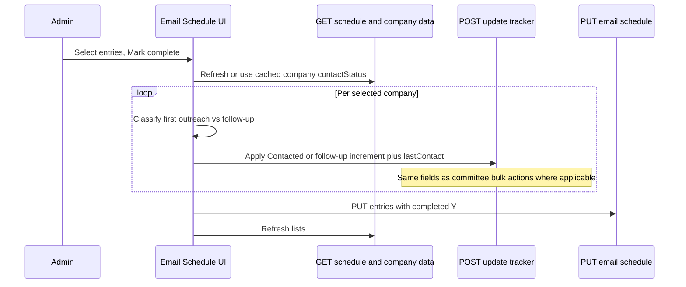
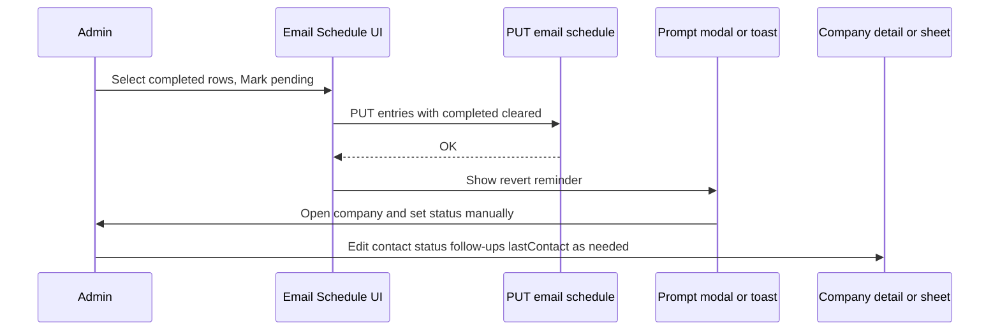
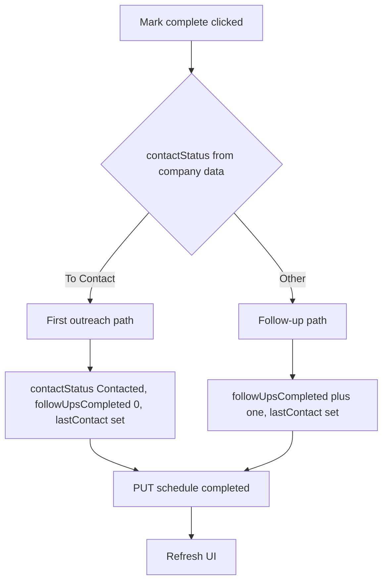

# Email Schedule — Mark Complete Updates Contact Status

## 1. Feature / Task Overview

**Purpose:** When an admin marks one or more scheduled email rows as complete on the Email Schedule page, the system should update tracker data in line with Committee Workspace and the company detail page: first-contact outreach moves a company from **To Contact** to **Contacted** and sets follow-up baseline; subsequent sends increment the follow-up counter and refresh **last committee contact**, without inventing new status rules on this page alone.

**Scope:** Behavior change on `email-schedule` for **Mark complete** and **Mark pending**. **Mark complete** updates the tracker like Committee Workspace. **Mark pending** is intentionally **two steps** so the Google Sheet does not need new columns for undo metadata:

1. **Step 1 — Schedule only:** Clear the row’s `completed` flag in `Email_Schedule` (same as today’s PUT with `completed` empty). The chip returns to “pending” on the Email Schedule page.
2. **Step 2 — User prompt:** Show a clear prompt (modal, banner, or toast with next steps) telling the admin to **open the company** and **manually** adjust **contact status** (and, if they care about consistency, **follow-ups** / **last contact**) to match reality — for example **Contacted** → **To Contact**, or roll back a follow-up increment if **Mark complete** had used the follow-up path. The app does **not** auto-revert tracker fields.

**Out of scope unless agreed:** Changing how Committee Workspace works; automatic tracker undo on Mark pending; new `Email_Schedule` columns for snapshots.

**Toolbar — which completion action to show:** **Mark complete** appears only when every selected schedule row is **not** completed (`completed` blank). **Mark pending** appears only when every selected row is **completed** (`completed` = Y). If the selection mixes completed and pending rows, **neither** button is shown and a short hint asks the user to narrow the selection. This reflects **schedule slot** completion state, not the company’s CRM **contact status** (To Contact / Contacted / etc.).

---

## 2. Flow Visualization

---

## 3. Relevant Files

| File | Role |
|------|------|
| `outreach-tracker/pages/email-schedule.tsx` | Bulk Mark complete / Mark pending; Mark complete orchestrates `POST /api/update` then schedule PUT; Mark pending only schedule PUT plus **user prompt** for manual tracker edits. |
| `outreach-tracker/pages/api/update.ts` | Persists `contactStatus`, `followUpsCompleted`, `lastContact`, remarks; contains automatic **No Reply** logic when `contactStatus` is not part of the update payload—design must stay consistent with Committee Workspace. |
| `outreach-tracker/pages/api/email-schedule/index.ts` | PUT handler persists schedule rows including `completed`; **no schema change** required for Mark pending two-step flow. |
| `outreach-tracker/pages/companies/[id].tsx` | Where admins **manually** fix status after the Mark pending prompt; optional deep links from the prompt. Reference for staged outreach logging and schedule mark-complete behavior. |
| `outreach-tracker/components/committee-workspace.tsx` | Reference behavior for **Log outreach** (To Contact → Contacted) and **Log follow up** (increment follow-ups, `lastContact` only). |
| `outreach-tracker/components/ConfirmModal.tsx` (or similar) | Optional reuse for the post–Mark pending reminder dialog. |

---

## 4. References and Resources

- [Next.js API Routes](https://nextjs.org/docs/pages/building-your-application/routing/api-routes) — request handlers for `update` and `email-schedule`.
- Internal doc: `docs/plans/email-schedule-keep-on-day-plan.md` — schedule entries persist; completion is a sheet flag plus tracker state elsewhere.
- Internal doc: `docs/plans/2026-03-17-to-follow-up-status.md` — `completed` on schedule rows and interaction with remarks.

---

## 5. Task Breakdown

### Dependencies (global)

- Tracker updates must use the same auth expectations as existing `POST /api/update` from the app (committee member name or session user as today).
- Order of operations should avoid a state where the tracker thinks outreach happened but the schedule row is still pending, or the reverse, for long periods; prefer completing the schedule PUT after successful updates or using a single user-visible failure path.

---

## Phase A — Define parity rules

### Task A1: Document status branching for Mark complete

- **Description:** Specify one rule table used by implementation: for each `contactStatus` (at least **To Contact** vs everything else), which `updates` object shape is sent to `POST /api/update`, matching Committee Workspace **Log outreach** vs **Log follow up** and the company detail **Log outreach** staging rules.
- **Relevant files:** This plan only; optionally a short comment in `email-schedule.tsx` pointing to committee parity.
- **Sub-tasks:**
  - [x] Confirm **To Contact** → `Contacted`, `followUpsCompleted` reset to 0, `lastContact` set to action time (same semantics as committee first outreach).
  - [x] Confirm non–**To Contact** → increment `followUpsCompleted`, set `lastContact`, do not set `contactStatus` unless a separate product rule is added.
  - [x] Choose remark prefix pattern for bulk actions (for example aligned with committee: Outreach vs Follow-up numbering) so Thread History and remarks stay interpretable.

**Dependencies:** None.

---

## Phase B — Email Schedule UI and orchestration

### Task B1: Resolve company identity and status per selected row

- **Description:** For each selected schedule entry, resolve the canonical company id and latest `contactStatus` (and `followUpsCompleted` if needed for increment) using the same resolver used for opening a company from a row, combined with `allAssignments` keyed by id. Handle stale data by refreshing company data before applying bulk Mark complete when selection is non-empty.
- **Relevant files:** `outreach-tracker/pages/email-schedule.tsx`
- **Sub-tasks:**
  - [x] Build a per-entry or per-company map from selection to `contactStatus` and follow-up count after a fresh fetch.
  - [x] De-duplicate by `companyId` when multiple rows refer to the same company so one Mark complete does not double-apply tracker updates.

**Dependencies:** Task A1.

### Task B2: Call tracker update then schedule PUT

- **Description:** Extend `handleBulkMarkComplete` so it performs tracker updates for affected companies, then writes `completed: Y` on the selected entries via existing PUT. Use background tasks and error handling consistent with the page (single failure message, refresh on partial failure as today).
- **Relevant files:** `outreach-tracker/pages/email-schedule.tsx`
- **Sub-tasks:**
  - [x] For each distinct company in the selection, `POST /api/update` with the chosen updates, `remark`, and `actionDate` consistent with committee bulk actions.
  - [x] On success for all tracker calls, run the existing PUT to mark selected entries complete (or merge into one PUT payload if the API supports mixed rows in one request).
  - [x] Refresh schedule and company data so kanban and schedule chips stay consistent.

**Dependencies:** Task B1.

---

## Phase C — Mark pending: schedule clear, then prompt (no auto tracker undo)

### Task C0: Conditional Mark complete / Mark pending buttons

- **Description:** Derive `allPending` / `allComplete` / `mixed` from selected rows’ `completed` field. Show **Mark complete** only for all-pending selections; **Mark pending** only for all-complete; for mixed selections, show neither and a one-line hint.
- **Relevant files:** `outreach-tracker/pages/email-schedule.tsx`
- **Sub-tasks:**
  - [x] Implement `useMemo` over `selectedEntries` for completion mode.
  - [x] Wire bottom action bar buttons to this mode.

**Dependencies:** None.

### Task C1: Keep Mark pending as sheet-only write

- **Description:** **Mark pending** continues to call `PUT /api/email-schedule` with `completed` cleared for selected rows — **no** `POST /api/update`. This matches “first part” of the two-part action.
- **Relevant files:** `outreach-tracker/pages/email-schedule.tsx`
- **Sub-tasks:**
  - [x] Preserve existing optimistic update + refresh behavior after PUT.
  - [x] Ensure button title / aria text reflects two-step expectation (see Task C2).

**Dependencies:** Task C0 (button only visible when selection is all-complete).

### Task C2: Prompt user to manually revert contact status

- **Description:** After a successful Mark pending PUT, show a **prompt** (modal is clearest for multiple companies; toast may suffice for one). Copy should explain: the schedule slot is pending again, but **tracker** fields may still reflect the earlier **Mark complete**; the user should open each company and **manually** set **contact status** (and adjust **follow-ups** / **last committee contact** if needed). Optionally list resolved company names and include **Open** links using the same resolver as double-click (`/companies/[id]`).
- **Relevant files:** `outreach-tracker/pages/email-schedule.tsx`; optionally `outreach-tracker/components/ConfirmModal.tsx` or a small dedicated modal component.
- **Sub-tasks:**
  - [x] Trigger prompt only after successful schedule PUT.
  - [x] For multiple selections, list all affected companies (dedupe by company id).
  - [x] Short guidance examples: e.g. if they had marked first outreach by mistake, set status back to **To Contact**; if follow-up was mistaken, decrement follow-up count on company page as appropriate.
  - [x] Dismissible; no automatic `POST /api/update` from this flow.

**Dependencies:** Task C1.

---

## 6. Potential Risks / Edge Cases

- **Stale `contactStatus`:** If `allAssignments` is outdated, a company might be classified wrong once. Mitigation: refresh `/api/data` immediately before bulk Mark complete or optimistically re-fetch after any prior action.
- **Duplicate slots same day:** Selection uses row identity; de-duplication by company id avoids double incrementing when two rows exist for one company.
- **Temporary mismatch after Mark pending:** Schedule shows “pending” while tracker still shows **Contacted** or inflated follow-ups until the user edits the company — this is **expected** for the two-part design; the prompt must make it obvious.
- **User skips manual step:** Data inconsistency persists; acceptable trade-off vs sheet schema work; optional future doc for admins.
- **Automatic No Reply in `update.ts`:** When `contactStatus` is omitted on follow-up-only updates, existing auto **No Reply** rules may still run. This matches current committee **Log follow up** behavior; do not bypass unless product requests a change.
- **Multi-company partial failure:** Some companies may update and others fail; define UX (toast, retry, refresh) so admins are not left with half-applied expectations.
- **Non-admin viewers:** Page is view-only for non-admins; ensure no new write paths bypass existing guards.

---

## 7. Testing Checklist

### Mark complete — first outreach

- [ ] Company at **To Contact** with a scheduled row; select that row; **Mark complete**; confirm **Contacted** in All Companies / company detail and schedule row shows completed styling.
- [ ] Remark or audit trail reads like a first outreach (consistent wording with committee bulk outreach).

### Mark complete — follow-up

- [ ] Company at **Contacted** (or other non–To Contact per rule table); **Mark complete**; confirm `followUpsCompleted` increases by one and **last contact** updates; `contactStatus` unchanged unless auto **No Reply** triggers per existing rules after several follow-ups.

### Selection and duplicates

- [ ] Two schedule rows same company same day; select both; Mark complete once; tracker increments appropriately once, not twice.

### Failure handling

- [ ] Simulate failed `POST /api/update`; user sees failure; schedule rows do not show as completed unless implementation explicitly completes schedule after tracker success only.

### Permissions

- [ ] Non-admin cannot Mark complete (existing behavior preserved).

### Completion toolbar (schedule row state)

- [ ] Select only **pending** rows → **Mark complete** is shown; **Mark pending** is hidden.
- [ ] Select only **completed** rows → **Mark pending** is shown; **Mark complete** is hidden.
- [ ] Mix pending and completed → hint text appears; neither completion button is shown (Move / Delete unchanged).

### Mark pending — two-part action

- [ ] **Mark pending** clears `completed` in the schedule; chip is no longer green / completed.
- [ ] A **prompt** appears explaining that contact status (and follow-ups / last contact if applicable) must be **manually** corrected on the company page.
- [ ] User can open linked company pages and verify tracker matches intent after manual edits.
- [ ] No automatic `POST /api/update` runs from Mark pending.

---

## 8. Notes

- Parity target: **Committee Workspace** bulk **Log outreach** and **Log follow up**, not the separate **Log company response** / **Log our reply** actions—those remain on Committee Workspace unless Email Schedule gains explicit buttons later.
- **Log company response** (move to **To Follow Up** + **Interested**) is intentionally not tied to schedule **Mark complete** in this plan; admins should use Committee Workspace or company detail for that workflow unless scope expands.
- **Manual revert guidance:** Examples for the prompt — mistaken first outreach → set **Contacted** back to **To Contact**; mistaken follow-up → reduce **follow-ups completed** and fix **last contact** on the company form as the admin remembers. No automatic rule engine required.

## 9. Implementation Notes

- Implemented in `outreach-tracker/pages/email-schedule.tsx`.
- `Mark complete` now fetches fresh company data from `/api/data?refresh=true`, resolves canonical company ids with `buildScheduleRowResolver(...)`, de-duplicates by company id, then mirrors Committee Workspace behavior:
  - `To Contact` → `contactStatus: Contacted`, `followUpsCompleted: 0`, `lastContact: <timestamp>`
  - otherwise → `followUpsCompleted + 1`, `lastContact: <timestamp>`
- The schedule row is marked complete only after tracker updates succeed; on failure the page refreshes back to server state.
- The completion toolbar now keys off selected schedule rows’ `completed` flag:
  - all pending → show `Mark complete`
  - all complete → show `Mark pending`
  - mixed → show neither, plus a hint
- `Mark pending` remains schedule-only. After a successful PUT, the page opens an inline reminder modal listing affected companies with `Open company` actions so admins can manually fix tracker fields.
- `ConfirmModal` was not reused for the manual-revert prompt because the shipped UI needs richer copy plus per-company action buttons.
