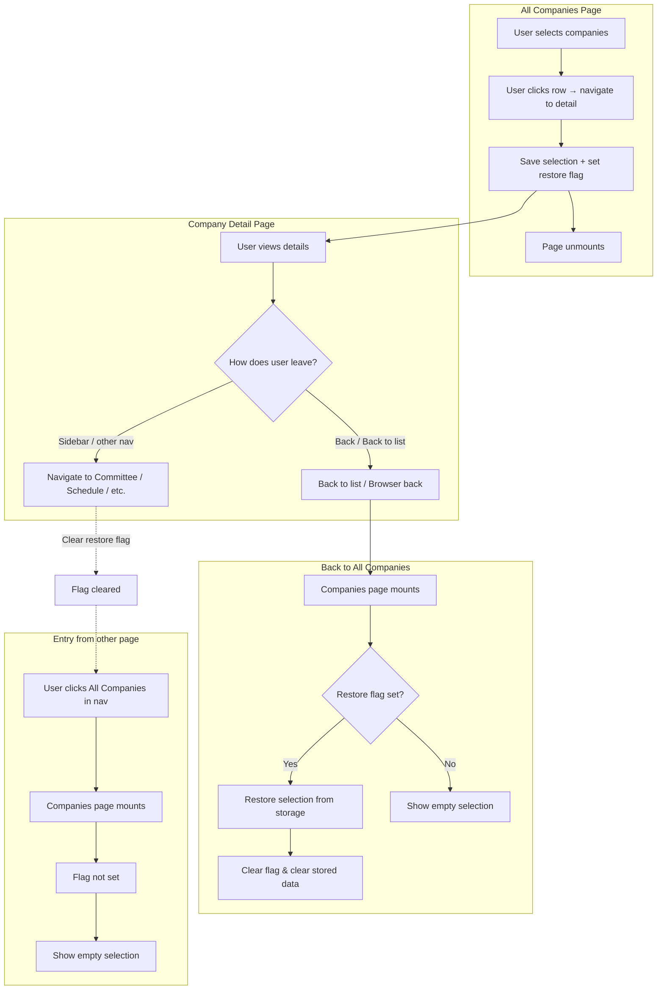
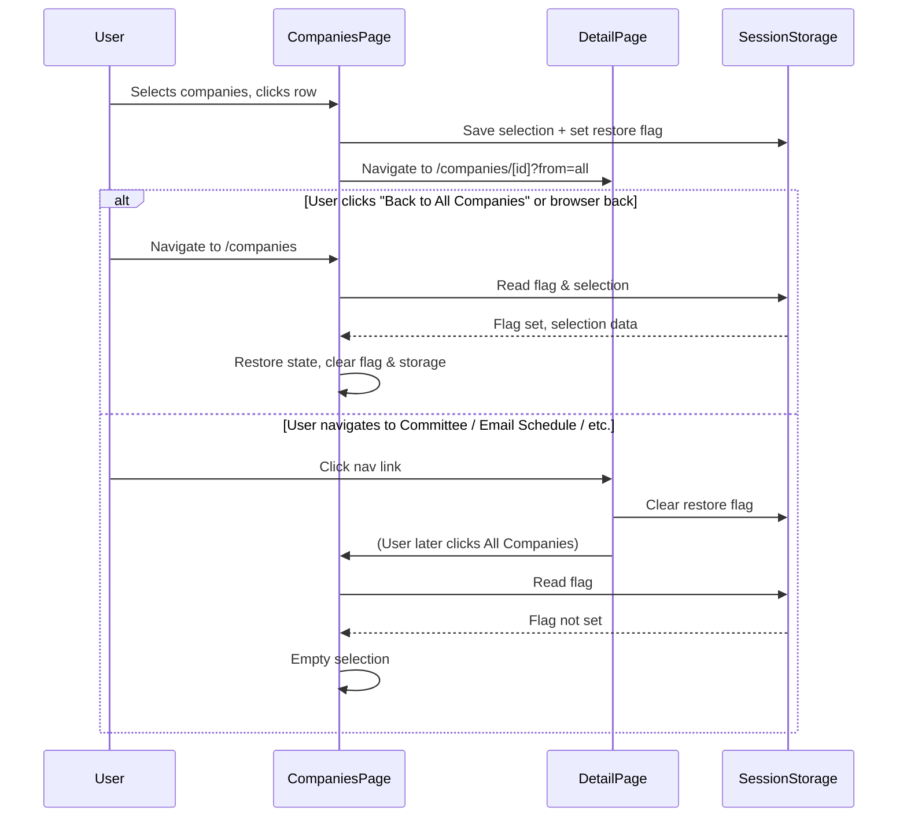

# Persistent Selection on All Companies Page — Implementation Plan

> **For Claude:** REQUIRED SUB-SKILL: Use superpowers:executing-plans to implement this plan task-by-task.

**Goal:** Keep checkbox selection on the All Companies page when the user clicks a row to view company details and then returns to the list; do not restore selection when the user lands on All Companies from any other page (sidebar, Committee, Email Schedule, etc.).

**Architecture:** Use sessionStorage to store selected company IDs and a “restore” flag. Set the flag and save selection only when navigating from the All Companies list to a company detail page (`from=all`). On the companies list page mount, restore selection only if the flag is set, then clear the flag. On the company detail page, clear the restore flag when the user navigates away to any route that is not `/companies`, so that later visits to All Companies from elsewhere do not restore.

**Tech Stack:** Next.js (Pages Router), React, sessionStorage, existing `companies.tsx` and `AllCompaniesTable.tsx`.

---

## 1. Feature/Task Overview

- **Purpose:** Avoid losing multi-selection when a user accidentally (or intentionally) clicks a company row to open details; restore the same selection when they come back to the list.
- **Scope:** Only the “All Companies → Company Detail → Back to All Companies” flow. All other entry points to All Companies (sidebar, Committee, Email Schedule, direct URL, refresh) must show no restored selection.

---

## 2. Flow Visualization

---

## 3. Relevant Files

| File | Role |
|------|------|
| `outreach-tracker/pages/companies.tsx` | Owns `selectedCompanies` and `lastSelectedIndex`; handles `handleCompanyClick` (navigate to detail). Must save selection and set restore flag before navigation; on mount, read flag and optionally restore selection. |
| `outreach-tracker/components/AllCompaniesTable.tsx` | Receives selection and callbacks from parent; no direct change to persistence (parent owns storage). Table already uses `companies_*` sessionStorage keys for filters/sort. |
| `outreach-tracker/pages/companies/[id].tsx` | Company detail page. Must clear the restore flag when the user navigates away to a route other than `/companies` (e.g. Committee, Email Schedule, Dashboard). |

---

## 4. References and Resources

- Existing sessionStorage usage: `AllCompaniesTable.tsx` (e.g. `GLOBAL_SEARCH_STORAGE_KEY`, `companies_sortField`, `companies_columnFilters`).
- Navigation to detail: `companies.tsx` uses `router.push(\`/companies/${encodeURIComponent(companyId)}?from=all\`)`.
- Detail page back link: `companies/[id].tsx` uses `Link href={...'/companies'} when from=all`.
- Next.js router events: `router.events` for `routeChangeStart` / `routeChangeComplete` to detect navigation away from detail.

---

## 5. Task Breakdown

### Phase 1: Persist selection when leaving the list for company detail

#### Task 1.1: Define storage keys and save selection on navigate to detail

- **Description:** Introduce sessionStorage keys for “restore” flag and selection (and optionally lastSelectedIndex). When the user triggers navigation from the All Companies list to a company detail page, write current selection and set the flag before calling `router.push`.
- **Relevant files:** `outreach-tracker/pages/companies.tsx`
- **Sub-tasks:**
  - [x] Define constants for sessionStorage keys (e.g. `companies_selection_restore`, `companies_selection`, `companies_lastSelectedIndex`) in a single place (e.g. top of file or a small util).
  - [x] In `handleCompanyClick`, before `router.push`, persist `selectedCompanies` (e.g. JSON array of IDs) and set the restore flag; optionally persist `lastSelectedIndex` for shift-click UX.
  - [x] Keep existing `router.push(\`/companies/${id}?from=all\`)` unchanged in behavior; only add the persistence step before it.

#### Dependencies

- None for Phase 1.

---

### Phase 2: Restore selection when returning to the list from detail

#### Task 2.1: On companies page mount, restore selection when flag is set

- **Description:** When the All Companies page mounts, read the restore flag from sessionStorage. If set, restore `selectedCompanies` (and optionally `lastSelectedIndex`) from stored data, then clear the flag and the stored selection data so future mounts do not restore unless the user again goes list → detail → list.
- **Relevant files:** `outreach-tracker/pages/companies.tsx`
- **Sub-tasks:**
  - [x] In `CompaniesPage`, add a mount effect (or initial state initializer) that runs only on client: read restore flag and stored selection.
  - [x] If flag is set, parse stored IDs and set `selectedCompanies` to a Set containing only IDs that exist in the current `data` (or `transformedCompanies`) so stale IDs are dropped; set `lastSelectedIndex` to null or a valid index if desired.
  - [x] After restoring, clear the restore flag and remove the stored selection (and lastSelectedIndex) from sessionStorage.
  - [x] Ensure this runs after data is available (e.g. after first load) so that “existing in list” check is meaningful.

#### Dependencies

- Phase 1 (storage format and keys must be defined and written when navigating to detail).

---

### Phase 3: Clear restore flag when leaving detail for a non-list page

#### Task 3.1: Clear restore flag on detail page when navigating away to non-/companies

- **Description:** On the company detail page, when the user navigates away to any route that is not the All Companies list (`/companies` without a segment), clear the restore flag so that if they later open All Companies from the sidebar or another page, selection is not restored.
- **Relevant files:** `outreach-tracker/pages/companies/[id].tsx`
- **Sub-tasks:**
  - [x] Use Next.js router events (e.g. `routeChangeStart` or `routeChangeComplete`) in a `useEffect` on the detail page.
  - [x] When the current route is the company detail route (`/companies/[id]`) and the next route is not exactly the list (e.g. not `/companies` or pathname not equal to `/companies`), remove the restore flag from sessionStorage.
  - [x] Subscribe on mount and unsubscribe on unmount to avoid leaks and double clears.

#### Dependencies

- Phase 1 (same storage key for the flag).

---

### Phase 4: Optional UX polish

#### Task 4.1: Back-to-list link with restore hint (optional)

- **Description:** Optionally, the “Back to All Companies” link on the detail page (when `from=all`) can point to `/companies?restore=1` so that even if the restore flag were ever cleared incorrectly, the list page can still restore when that query is present. List page would then remove the query after restoring (e.g. shallow replace).
- **Relevant files:** `outreach-tracker/pages/companies/[id].tsx`, `outreach-tracker/pages/companies.tsx`
- **Sub-tasks:**
  - [ ] If implementing: change the Back link href to `/companies?restore=1` when `from === 'all'`.
  - [ ] On companies page, if `router.query.restore === '1'`, treat as “restore”; after restoring, remove `restore` from URL (e.g. `router.replace('/companies', undefined, { shallow: true })`).

#### Dependencies

- Phase 2 (restore logic exists). Optional; can be skipped if flag-only approach is sufficient.

---

## 6. Potential Risks / Edge Cases

- **Stale IDs:** After a refresh or data update, stored IDs might no longer exist. Restore only IDs that exist in the current list; ignore or drop the rest.
- **Browser back vs. Back link:** Both should result in restore when the flag was set. Back link goes to `/companies`; browser back also lands on `/companies`. Flag is only cleared when leaving detail to a different section (e.g. Committee), not when going back to list.
- **Multiple tabs:** sessionStorage is per-origin per tab. Each tab has its own selection and flag; no cross-tab sync required for this feature.
- **Detail page route events:** Next.js router events fire for client-side navigations. Ensure the “next” path is compared correctly (e.g. `pathname === '/companies'` and no dynamic segment) so we only clear the flag when leaving to Committee, Email Schedule, etc., not when going to `/companies`.
- **lastSelectedIndex:** Stored index may refer to the previous filtered/sorted list. Restoring `lastSelectedIndex` as `null` is the safest; optionally restore to the index of the last selected item in the current `filteredAndSortedCompanies` if that list is available at restore time.

---

## 7. Testing Checklist

### Selection persistence (list → detail → list)

- [ ] On All Companies, select several companies (including multi-select and shift-click range).
- [ ] Click a company row (not the checkbox) to open company detail.
- [ ] On detail page, click “Back to All Companies” (or use browser Back).
- [ ] **Expected:** All Companies page shows the same companies still selected; bulk action bar and count match previous selection.

### No restore when entering from other pages

- [ ] Open All Companies, select some companies, then go to a company detail page (so flag is set and selection stored).
- [ ] From detail, navigate to Committee (or Email Schedule, or Dashboard) via sidebar or link.
- [ ] From that page, open “All Companies” via sidebar.
- [ ] **Expected:** All Companies page loads with no companies selected; bulk action bar is not shown.

### No restore on direct load or refresh

- [ ] Open All Companies via sidebar, select companies, then go to detail (flag set).
- [ ] Manually navigate to `/companies` in address bar (or refresh on All Companies after having restored once).
- [ ] **Expected:** If you landed from detail (Back), selection is restored once; if you landed by typing URL or refresh, no selection (or only the one-time restore from Back, then no selection on next load).

### Checkbox vs row click

- [ ] Select a few companies via checkboxes; click another row to open detail; return to list.
- [ ] **Expected:** Selection is restored; clicking the row did not clear selection.

### Stale IDs (if data changes)

- [ ] Select companies, go to detail, then (in another tab or after a refresh that removes a company) return to list where one of the stored IDs no longer exists.
- [ ] **Expected:** Selection is restored for IDs that still exist in the list; missing IDs are not selected; no errors.

---

## 8. Notes

- **Storage keys:** Reuse the existing `companies_*` naming (e.g. `companies_selection_restore`, `companies_selection`) for consistency with `AllCompaniesTable` sessionStorage keys.
- **Restore timing:** Run restore logic after the first data load on the companies page so that “existing in list” can be computed from `data` or `transformedCompanies`; otherwise defer restoration until data is available.
- **Back link:** The detail page’s “Back to All Companies” link currently goes to `/companies`. No URL change is strictly required if the sessionStorage flag is used; the optional `?restore=1` is a fallback for robustness.

---

## Implementation Notes

- **Phases 1–3 implemented.** Phase 4 (optional `?restore=1` back link) skipped; flag-only approach is sufficient.
- **companies.tsx:** Storage keys at top (`STORAGE_KEY_SELECTION_RESTORE`, `STORAGE_KEY_SELECTION`, `STORAGE_KEY_LAST_SELECTED_INDEX`). Selection and lastSelectedIndex saved in `handleCompanyClick` before `router.push`. Restore in a `useEffect` depending on `data`; `useRef(hasRestoredSelection)` ensures the restore check runs once per mount. Only IDs present in current `data` are restored; `lastSelectedIndex` set to `null` after restore.
- **companies/[id].tsx:** `STORAGE_KEY_SELECTION_RESTORE` defined locally. A `useEffect` subscribes to `router.events.on('routeChangeStart')` and removes the flag when destination pathname (`url.split('?')[0]`) is not `'/companies'`, so navigating to list or browser back to list does not clear the flag.
- **Assumption:** Browser Back from detail to list leaves the flag set; list page mounts and restores after `data` is available.
- **Deviation:** None. Stale IDs filtered against `data` as specified.
