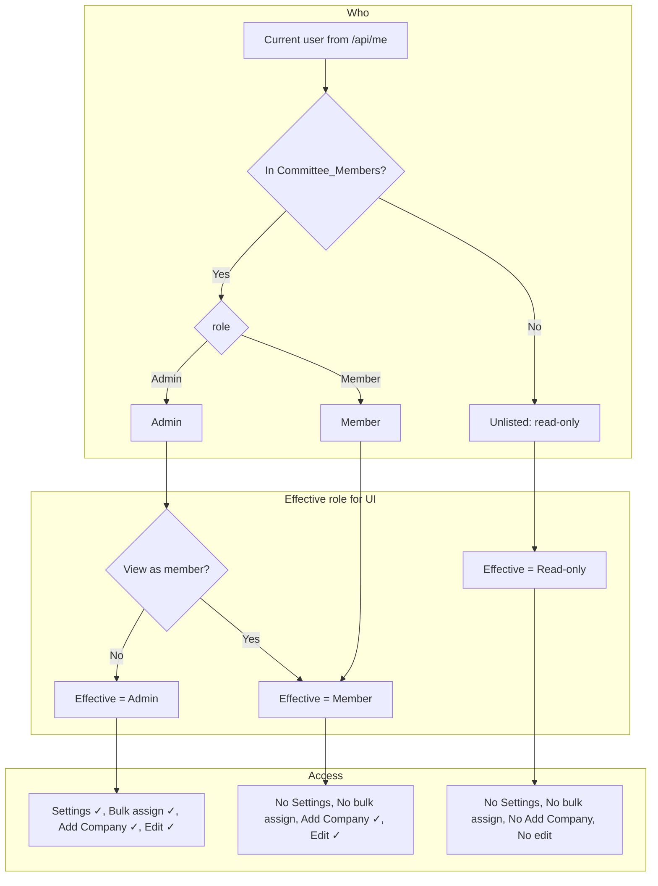
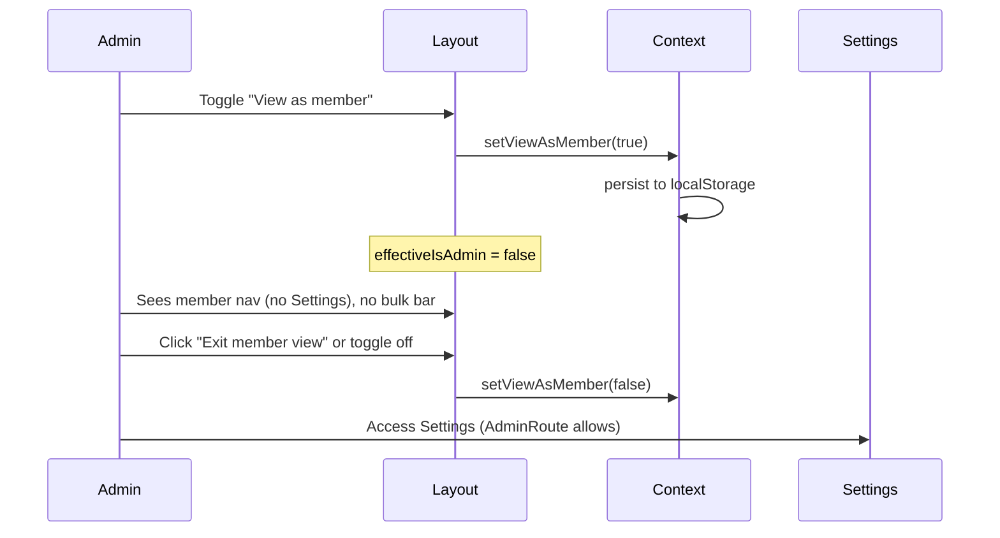

# Settings Admin-Only & View-as-Member Implementation Plan

## Status: Superseded

This plan’s **“View as member”** approach (UI-only role masking via localStorage) has been **superseded** by **SuperAdmin impersonation** (server-authoritative, per-member effective identity). Settings being admin-only remains valid, but do not implement or re-introduce the old view-as-member toggle.

## 1. Feature/Task Overview

- **Purpose:** (1) Make Settings admin-only and hide it from non-admins. (2) Let admins optionally view the platform as a member to see the member interface and controls. (3) Keep Add Company available to both admins and members. (4) Allow company-detail edits for admins and members; keep unlisted users read-only (no Add Company, no edits).
- **Scope:** UI and route protection only for Settings; new “view as member” toggle and effective-role logic; explicit permission rules for Add Company and company edits (frontend + API). Unlisted users remain read-only.

---

## 2. Flow Visualization

---

## 3. Relevant Files

| File | Role |
|------|------|
| `outreach-tracker/pages/settings.tsx` | Settings page; wrap with AdminRoute. |
| `outreach-tracker/components/AdminRoute.tsx` | Protects Settings; redirect non-admins. |
| `outreach-tracker/components/Layout.tsx` | Nav: show Settings only for effective admin; add “View as member” toggle and “Exit member view” for admins. |
| `outreach-tracker/contexts/CurrentUserContext.tsx` | Add view-as-member state and effective-role helper (or new ViewAsMemberContext). |
| `outreach-tracker/pages/companies.tsx` | Use effective admin for bulk-assign UI; ensure Add Company visible for admins and members (hidden for unlisted). |
| `outreach-tracker/pages/companies/[id].tsx` | Show edit/update/delete controls only when user is committee member (not unlisted). |
| `outreach-tracker/pages/api/update.ts`, `update-contact.ts`, `add-company.ts`, `delete-contact.ts`, etc. | Enforce: listed (Admin or Member) can write; unlisted 403. |
| `outreach-tracker/pages/api/bulk-assign.ts` | Keep admin-only (no change). |

---

## 4. References and Resources

- Existing plan: `docs/plans/google-login-sheet-roles-plan.md`
- Auth and user: `outreach-tracker/docs/CURRENT_USER_AND_AUTH.md`

---

## 5. Task Breakdown

### Phase 1: Settings admin-only

#### Task 1.1 — Restrict Settings route to admins

- **Description:** Only admins can open the Settings page; others are redirected.
- **Relevant files:** `pages/settings.tsx`, `components/AdminRoute.tsx`
- **Sub-tasks:**
  - [x] Wrap the Settings page (or its content) with `AdminRoute` so unauthenticated, unlisted, and member users are redirected (e.g. to home).
  - [x] Ensure direct URL access to `/settings` is blocked for non-admins (AdminRoute handles this client-side; optional: add server-side check in a Settings-specific getServerSideProps or API if needed).

#### Task 1.2 — Hide Settings from nav for non-admins

- **Description:** Show the Settings link in the sidebar/nav only when the user is an admin (real role, not “view as member”).
- **Relevant files:** `components/Layout.tsx`
- **Sub-tasks:**
  - [x] In Layout, include the Settings nav item (or profile/settings entry) only when `user?.isAdmin === true`. Use real `isAdmin` from context so “view as member” does not hide the Settings link for an admin who might want to exit member view (see Phase 2). If the design is “when viewing as member, hide Settings,” then use effective admin instead (and provide another way to exit member view, e.g. banner).

---

### Phase 2: “View as member” for admins

**→ Remove this feature once the dashboard is complete.** Strip view-as-member state, toggle, banner, and `effectiveIsAdmin`; revert to using `user?.isAdmin` for nav and bulk-assign bar.

#### Task 2.1 — View-as-member state and persistence

- **Description:** Add a way for admins to toggle “view as member” and persist it across refreshes.
- **Relevant files:** `contexts/CurrentUserContext.tsx` (or new `contexts/ViewAsMemberContext.tsx`)
- **Sub-tasks:**
  - [x] Add state: `viewAsMember: boolean` (default false). Only relevant when `user?.isAdmin === true`; ignore for non-admins.
  - [x] Persist `viewAsMember` to localStorage (e.g. key `outreach_view_as_member`) so it survives refresh.
  - [x] Expose `setViewAsMember(value: boolean)` and optionally a toggle. Clear or ignore when user is not admin (e.g. on next load or when `user` changes to non-admin).
  - [x] Document: when `user.isAdmin && viewAsMember`, the “effective” role for UI is member; otherwise use actual role.

#### Task 2.2 — Effective role helper

- **Description:** Components use an “effective” admin flag so that when an admin is “viewing as member,” they see the member UI.
- **Relevant files:** `contexts/CurrentUserContext.tsx`
- **Sub-tasks:**
  - [x] From context, expose `effectiveIsAdmin = user?.isAdmin === true && !viewAsMember`. Use this in Layout (for showing Settings or not when you want “view as member” to hide Settings) and in companies list for bulk-assign bar. Keep using real `user.isAdmin` for AdminRoute (Settings page) so the admin can still open Settings when they turn off “view as member.”
  - [x] Alternative: use `effectiveIsAdmin` everywhere for UI (bulk bar, Settings link), and provide a visible “Exit member view” control that sets `viewAsMember` to false and optionally navigates to Settings or home.

#### Task 2.3 — Toggle and “Exit member view” in the UI

- **Description:** Admins can turn “view as member” on/off and see when they are in member view.
- **Relevant files:** `components/Layout.tsx`
- **Sub-tasks:**
  - [x] For users with `user?.isAdmin`, add a control to toggle “View as member” (e.g. in the user block, dropdown, or a small settings/eye icon). When `viewAsMember` is true, show “Exit member view” (or “View as admin”) to switch back.
  - [x] When `viewAsMember` is true, show a small persistent banner or pill (e.g. “Viewing as member”) so the admin knows the current mode, with an “Exit” action.
  - [x] Ensure Settings link visibility is consistent: either hide when `effectiveIsAdmin` is false (and rely on “Exit member view” to get back) or keep Settings link for admins even when viewing as member (so they can open Settings and turn off the toggle there). Recommended: hide Settings when viewing as member and show “Exit member view” in the banner so they can switch back without needing Settings.

---

### Phase 3: Add Company and company edits by role

#### Task 3.1 — Add Company: admins and members only

- **Description:** Add Company button and flow are available to admins and members; hidden for unlisted users.
- **Relevant files:** `pages/companies.tsx`
- **Sub-tasks:**
  - [x] Show “Add Company” button only when `user?.isCommitteeMember` (or equivalent: user is in Committee_Members sheet). This hides it for unlisted users; both admins and members see it.
  - [x] Ensure Add Company API (`add-company.ts`) rejects unlisted users (return 403 if session user not in Committee_Members).

#### Task 3.2 — Company detail edits: admins and members only

- **Description:** Edit company, update status, assign PIC, add/edit/delete contacts: allowed for admins and members; hidden and blocked for unlisted users.
- **Relevant files:** `pages/companies/[id].tsx`, APIs: `update.ts`, `update-contact.ts`, `delete-contact.ts`
- **Sub-tasks:**
  - [x] In company detail page, gate all edit/update/delete controls (edit mode, status change, assignee dropdown, add/edit/delete contact, save buttons) on `user?.isCommitteeMember`. When false (unlisted), show read-only view: no edit button, no status/assignee dropdowns, no add contact, no edit/delete contact buttons.
  - [x] In `update.ts`, `update-contact.ts`, `delete-contact.ts`: after validating session, resolve user from Committee_Members by session email; if not found, return 403 with a clear message (e.g. “Not authorized to modify data”). Do not allow unlisted users to mutate.

#### Task 3.3 — Bulk assign remains admin-only

- **Description:** Bulk assign bar and API stay admin-only; use effective role for UI so “view as member” hides the bar.
- **Relevant files:** `pages/companies.tsx`, `pages/api/bulk-assign.ts`
- **Sub-tasks:**
  - [x] In companies list, show bulk-assign bar (and selection hint) only when `effectiveIsAdmin` (so admins see it, but not when “viewing as member”). No change to bulk-assign API: keep admin-only check as today.
  - [x] Optionally hide row checkboxes when `!effectiveIsAdmin` to avoid members selecting rows with no action (or keep checkboxes for future use); if hidden, only show for `effectiveIsAdmin`.

---

### Phase 4: Unlisted users — read-only experience

#### Task 4.1 — All Companies for unlisted users

- **Description:** Unlisted users can view the list but cannot add companies or use bulk assign.
- **Relevant files:** `pages/companies.tsx`
- **Sub-tasks:**
  - [x] Add Company button already gated by `isCommitteeMember` (Phase 3). Bulk bar gated by `effectiveIsAdmin` (admins only). Unlisted users have no Settings link (Phase 1). No extra UI needed for unlisted on this page beyond existing role checks.

#### Task 4.2 — Company detail and Committee for unlisted users

- **Description:** Unlisted users see company detail in read-only form; Committee page shows “only for committee members” (existing behavior).
- **Relevant files:** `pages/companies/[id].tsx`, `pages/committee.tsx`
- **Sub-tasks:**
  - [x] Company detail: when `!user?.isCommitteeMember`, render read-only (no edit controls) as in Task 3.2.
  - [x] Committee: existing message for non-committee users already covers unlisted; no change required unless copy needs to mention “or add you to the committee list.”

---

### Dependencies

- Phase 1 can be done first (Settings admin-only and nav).
- Phase 2 (view as member) depends on Phase 1 for consistent behavior (admin sees Settings only when not viewing as member).
- Phase 3 and 4 can be done in parallel after Phase 1; they depend on `isCommitteeMember` and API enforcement.

---

## 6. Potential Risks / Edge Cases

- **View-as-member persistence:** If an admin logs out and a member logs in on the same device, clear `viewAsMember` when the user is not admin (e.g. in context init or when `user` is set from `/api/me`).
- **Direct URL to Settings:** Non-admins hitting `/settings` get redirected by AdminRoute; ensure no flash of Settings content (e.g. show loading/redirect until auth check completes).
- **APIs:** All write APIs must validate “listed in Committee_Members” (and bulk-assign must also require role Admin). Unlisted users must receive 403, not 401, for write attempts.
- **Add Company:** Confirm `add-company.ts` is called only when the button is shown; still enforce server-side so that a crafted request from an unlisted user is rejected.

---

## 7. Testing Checklist

**Settings admin-only**

- [ ] As admin: Settings link visible (when not viewing as member); can open Settings.
- [ ] As member: Settings link not in nav; direct visit to `/settings` redirects to home (or intended page).
- [ ] As unlisted: Same as member (no Settings link, redirect from `/settings`).

**View as member**

- [ ] As admin: Can turn on “View as member”; Settings link disappears; bulk-assign bar disappears; “Viewing as member” (or similar) and “Exit member view” are visible.
- [ ] As admin: After “Exit member view,” Settings and bulk-assign bar reappear.
- [ ] As admin: Refresh with “view as member” on keeps the mode (localStorage); after exit, refresh keeps “view as admin.”
- [ ] As member: No “View as member” toggle (only for admins).
- [ ] As unlisted: No toggle.

**Add Company**

- [ ] As admin: Add Company button visible; can add a company successfully.
- [ ] As member: Add Company button visible; can add a company successfully.
- [ ] As unlisted: Add Company button not visible; direct POST to add-company API returns 403.

**Company detail edits**

- [ ] As admin: Can edit company, change status/PIC, add/edit/delete contacts, save.
- [ ] As member: Same as admin for company edits.
- [ ] As unlisted: Company detail page is read-only (no edit controls); POST to update/update-contact/delete-contact returns 403.

**Bulk assign**

- [ ] As admin: Bulk-assign bar appears when rows selected; assign works.
- [ ] As admin with “View as member” on: Bulk-assign bar does not appear; same selection has no assign UI.

---

## 8. Notes

- **Effective vs real role:** Use `effectiveIsAdmin` only for UI (nav, bulk bar, any member-only vs admin-only controls). Use real `user.isAdmin` for AdminRoute and API so that “view as member” does not revoke real permissions.
- **Add Company:** Explicitly allowed for both Admin and Member; only unlisted are restricted.
- **Edits:** Any listed user (Admin or Member) can edit company details; only unlisted are read-only. Bulk assign remains an admin-only action.

---

## Implementation Notes (completed)

- **Settings:** Page content lives in `SettingsContent`; default export wraps it with `<AdminRoute><SettingsContent /></AdminRoute>`. AdminRoute uses real `user.isAdmin`.
- **Layout:** Nav and profile Settings link use `effectiveIsAdmin` so they disappear when an admin toggles "View as member." Non-admins see a non-clickable profile block.
- **View-as-member:** Stored in localStorage key `outreach_view_as_member` (`'1'` = true). Cleared when `user` is set and not admin; restored from storage when user is admin.
- **Company detail:** All mutable controls use `disabled={!canEdit}` or conditional render; `InteractionSection` has `disabled` prop. Unlisted users see a single "Refresh Data" button in the footer.
- **APIs:** `add-company`, `update`, `update-contact`, `delete-contact` each require session + Committee_Members lookup; 403 if not in sheet. `bulk-assign` unchanged (admin-only).
- **Deviations:** Row checkboxes on All Companies remain visible for all (plan left this optional).
