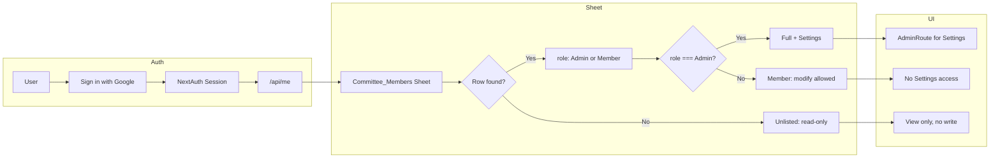
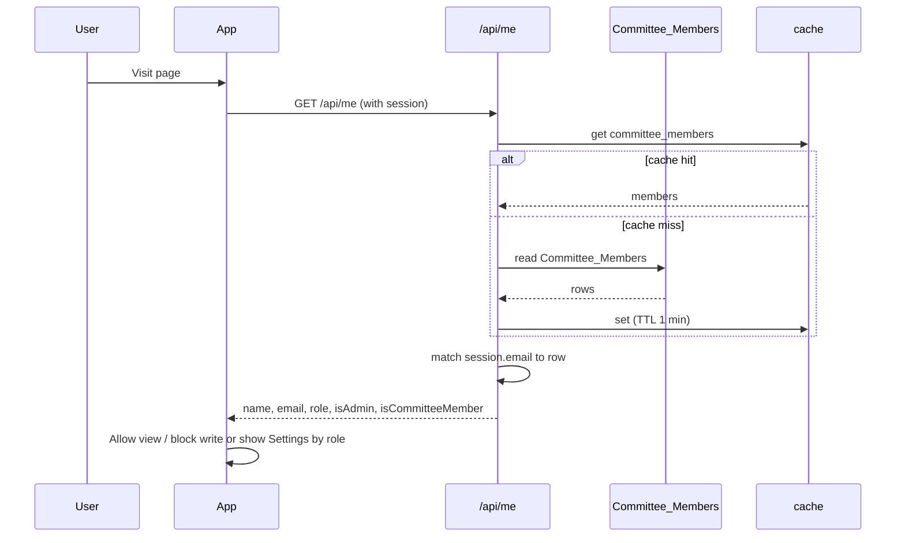

# Google Login & Sheet-Based Roles — Implementation Plan

## 1. Feature/Task Overview

- **Purpose:** Harden and document the existing Google login and role system so that (1) only users listed in the **Committee_Members** sheet can modify data, (2) **Settings** is admin-only, (3) roles are exactly **Admin** and **Member**, and (4) admins can refresh committee data immediately.
- **Scope:** No new auth stack; use existing NextAuth + Google and `Committee_Members` in the outreach tracker sheet (SPREADSHEET_ID_2). Add read-only behavior for unlisted users, protect Settings, normalize roles, and add cache refresh.

---

## 2. Flow Visualization

---

## 3. Relevant Files

| File | Role |
|------|------|
| `outreach-tracker/lib/auth.ts` | NextAuth config, Google provider, session callbacks. |
| `outreach-tracker/pages/api/auth/[...nextauth].ts` | NextAuth API route handler. |
| `outreach-tracker/pages/api/me.ts` | Resolves session → Committee_Members → name, email, role, isAdmin, isCommitteeMember. |
| `outreach-tracker/lib/committee-members.ts` | Reads Committee_Members from sheet, caches result, exposes `getCommitteeMembers` and role lookup. |
| `outreach-tracker/lib/cache.ts` | LRU cache used for committee members; need a way to invalidate `committee_members` key. |
| `outreach-tracker/lib/google-sheets.ts` | Google Sheets client used by committee-members. |
| `outreach-tracker/contexts/CurrentUserContext.tsx` | Provides current user (from /api/me) to the app. |
| `outreach-tracker/components/AuthButton.tsx` | Sign in / sign out UI. |
| `outreach-tracker/components/AdminRoute.tsx` | Wraps content; redirects non-admins (e.g. to home). |
| `outreach-tracker/components/Layout.tsx` | Nav and layout; may hide Settings link for non-admins. |
| `outreach-tracker/pages/_app.tsx` | SessionProvider and CurrentUserProvider. |
| `outreach-tracker/pages/index.tsx` | Home: landing vs dashboard by session. |
| `outreach-tracker/pages/settings.tsx` | Settings page; must be wrapped so only admins can access. |
| `outreach-tracker/pages/committee.tsx` | Committee workspace; uses isCommitteeMember. |
| `outreach-tracker/pages/companies.tsx` | All Companies; uses isAdmin for bulk assign and likely other writes. |
| `outreach-tracker/pages/companies/[id].tsx` | Company detail; may have edit/update actions. |
| API routes that perform writes (e.g. `update.ts`, `update-contact.ts`, `bulk-assign.ts`, `add-company.ts`, etc.) | Must enforce: listed user with write permission (Member or Admin) or admin-only where applicable. |

---

## 4. References and Resources

- Existing plan: `docs/plans/google_oauth_implementation.md`
- Auth and user model: `outreach-tracker/docs/CURRENT_USER_AND_AUTH.md`
- NextAuth.js docs: https://next-auth.js.org/ (configuration, session, getServerSession)
- Google Sheets API: used via `google-sheets.ts` and `committee-members.ts`

---

## 5. Task Breakdown

### Phase 1: Role and "unlisted user" behavior

#### Task 1.1 — Normalize roles to Admin and Member

- **Description:** Treat only "Admin" and "Member" as first-class roles; treat any other value as "Member" (or explicitly "Unlisted" when not in sheet).
- **Relevant files:** `lib/committee-members.ts`, `pages/api/me.ts`
- **Sub-tasks:**
  - [ ] In committee-members mapping, normalize role (e.g. trim, case-insensitive): if "admin" → Admin, else → Member.
  - [ ] In `/api/me`, derive `isAdmin` from normalized role; ensure `isCommitteeMember` is true for any user found in the sheet (Admin or Member).
  - [ ] Document in plan or code comment that the sheet should use only "Admin" or "Member" in the Role column.

#### Task 1.2 — Define "unlisted" user and read-only policy

- **Description:** Users signed in with Google but not in Committee_Members get no write access; they can only view.
- **Relevant files:** `pages/api/me.ts`, `contexts/CurrentUserContext.tsx` (types if needed)
- **Sub-tasks:**
  - [ ] In `/api/me`, for session present but no matching Committee_Members row, return a clear "unlisted" or "readOnly" flag (e.g. `isCommitteeMember: false`, and optionally `canEdit: false` or keep a single source of truth like "only isCommitteeMember can edit").
  - [ ] Document in plan: "Unlisted = authenticated but not in sheet → read-only; no Settings; no committee workspace assignments."

### Phase 2: Enforce read-only for unlisted users

#### Task 2.1 — API layer: block writes for unlisted users

- **Description:** All mutation APIs (create/update/delete company, contact, bulk-assign, etc.) must require the user to be in Committee_Members (i.e. isCommitteeMember or equivalent server-side check). Admin-only actions must additionally require role === Admin.
- **Relevant files:** `pages/api/update.ts`, `pages/api/update-contact.ts`, `pages/api/add-company.ts`, `pages/api/delete-contact.ts`, `pages/api/bulk-assign.ts`, and any other write APIs.
- **Sub-tasks:**
  - [ ] List every API route that modifies data (spreadsheet or app state).
  - [ ] In each, after validating session, fetch committee members and resolve current user by session email; if not found in sheet, return 403 with a message like "Not authorized to make changes."
  - [ ] Keep existing admin checks (e.g. bulk-assign) where only Admin is allowed.
  - [ ] Ensure no mutation is possible without being a listed Member or Admin.

#### Task 2.2 — Frontend: disable/hide write actions for unlisted users

- **Description:** Buttons and forms that create or update data (e.g. add company, edit company, bulk assign, add/edit/delete contact) must be hidden or disabled when the user is not a committee member (unlisted = read-only).
- **Relevant files:** `pages/companies.tsx`, `pages/companies/[id].tsx`, any modals or components that trigger mutations.
- **Sub-tasks:**
  - [ ] Use `user.isCommitteeMember` (and `user.isAdmin` where needed) to conditionally render or disable edit/add/delete controls.
  - [ ] Ensure unlisted users see view-only UIs (e.g. company list and detail without edit buttons).

### Phase 3: Settings admin-only and nav

#### Task 3.1 — Restrict Settings to admins only

- **Description:** Only users with role Admin can open the Settings page.
- **Relevant files:** `pages/settings.tsx`, `components/AdminRoute.tsx`, `pages/_app.tsx` or routing structure.
- **Sub-tasks:**
  - [ ] Wrap the Settings page content (or the whole page component) with `AdminRoute` so that non-admins are redirected (e.g. to home).
  - [ ] Ensure Settings route is only reachable when `user.isAdmin` is true (server-side check is optional but recommended for direct URL access).

#### Task 3.2 — Hide Settings from nav for non-admins

- **Description:** In the sidebar/nav, show the Settings link only to admins to avoid confusion.
- **Relevant files:** `components/Layout.tsx`
- **Sub-tasks:**
  - [ ] In Layout, include Settings in the nav only when `user?.isAdmin === true` (or equivalent from CurrentUserContext).

### Phase 4: Committee_Members in SPREADSHEET_ID_2

#### Task 4.1 — Confirm spreadsheet and sheet name

- **Description:** Ensure Committee_Members is always read from the outreach tracker sheet (SPREADSHEET_ID_2).
- **Relevant files:** `lib/committee-members.ts`, env docs or README.
- **Sub-tasks:**
  - [ ] In `getCommitteeMembers`, use SPREADSHEET_ID_2 as the primary (or only) spreadsheet ID for Committee_Members; remove or document fallback to SPREADSHEET_ID_1/SPREADSHEET_ID if currently used.
  - [ ] Document in README or deployment docs that Committee_Members must exist in the outreach tracker spreadsheet (ID from SPREADSHEET_ID_2).

### Phase 5: Immediate refresh for committee data

#### Task 5.1 — Cache invalidation for committee members

- **Description:** Provide a way to clear the committee_members cache so that changes in the Google Sheet (new users, role changes) take effect immediately.
- **Relevant files:** `lib/cache.ts`, `lib/committee-members.ts`
- **Sub-tasks:**
  - [ ] Export a function in committee-members (e.g. `invalidateCommitteeMembersCache`) that deletes or invalidates the cache key used for committee members.
  - [ ] Ensure the cache module supports deletion of a specific key (or document the key name so an API can clear it).

#### Task 5.2 — API and UI for refresh

- **Description:** Admins can trigger a refresh of committee data from the sheet.
- **Relevant files:** New or existing API (e.g. `pages/api/clear-cache.ts` or `pages/api/committee-members/refresh.ts`), `pages/settings.tsx`
- **Sub-tasks:**
  - [ ] Add an API route that (1) verifies session and admin (via Committee_Members lookup), (2) calls the committee-members cache invalidation, (3) optionally re-fetches and returns success/error. Do not expose this to non-admins.
  - [ ] In Settings (Data or a dedicated "Users & roles" section), add a button "Refresh committee members" or "Reload users from sheet" that calls this API and shows success/error (e.g. toast or inline message).
  - [ ] After a successful refresh, consider refetching `/api/me` on the client so the current user's role is up to date if it was changed in the sheet.

### Dependencies

- Phase 1 must be done first (role semantics and unlisted behavior).
- Phase 2 (API and frontend read-only) can run in parallel after Phase 1.
- Phase 3 depends on Phase 1 (isAdmin defined correctly).
- Phase 4 is independent and can be done anytime.
- Phase 5 (refresh) depends on Phase 1 and Phase 3 (admin-only Settings); the refresh API should be admin-only.

---

## 6. Potential Risks / Edge Cases

- **Cache TTL:** With a 1-minute TTL, role changes can still be delayed for up to 1 minute until refresh is used; document that "Refresh committee members" is the way to apply sheet changes immediately.
- **Sheet structure:** If Committee_Members has a different tab name or column order (e.g. Email in column A), lookups will break; document expected columns (e.g. Name, Email, Role) and that the sheet lives in SPREADSHEET_ID_2.
- **Direct URL access:** Users who are not admins might bookmark `/settings`; AdminRoute must redirect them so they never see Settings content.
- **Concurrent requests:** Cache invalidation and immediate refetch might cause a short race; acceptable if the next request gets fresh data.
- **Env vs sheet:** Ensure production does not rely on `NEXT_PUBLIC_CURRENT_USER_*` for identity; session + sheet are the source of truth for who can do what.

---

## 7. Testing Checklist

**Login and roles**

- [ ] Sign in with Google: user is redirected back and name/email appear (e.g. in header).
- [ ] Sign out: user is signed out and sees landing (or login) again.
- [ ] User in sheet with role "Admin": can open Settings and see "Refresh committee members"; can use bulk assign and other admin actions.
- [ ] User in sheet with role "Member": can edit companies/contacts assigned to them (or per existing rules); cannot open Settings; Settings link not visible in nav.
- [ ] User in sheet with role "Member" (or other value): is treated as Member, not Admin.

**Unlisted users (read-only)**

- [ ] Sign in with Google account that has no row in Committee_Members: can view dashboard and company list/detail.
- [ ] Same unlisted user: cannot see or use add company, edit company, bulk assign, add/edit/delete contact (buttons hidden or disabled).
- [ ] Same unlisted user: cannot open Settings (redirected or link not shown).
- [ ] Same unlisted user: direct POST to a write API returns 403 (or equivalent) with an appropriate message.

**Settings and refresh**

- [ ] As admin, open Settings and click "Refresh committee members"; success message appears and no error.
- [ ] After changing a user's role in the Google Sheet and clicking refresh, reload app (or refetch /api/me); role and permissions reflect the new value (e.g. Admin → Member or vice versa).
- [ ] As non-admin, calling the refresh API directly (e.g. via browser or curl) returns 403.

**Committee workspace**

- [ ] Committee member sees only their assignments (existing behavior).
- [ ] Unlisted user sees appropriate message or empty state on committee page (no assignments; no write actions).

---

## 8. Notes

- **Single source of truth:** The Committee_Members sheet (Name, Email, Role in SPREADSHEET_ID_2) is the authority for who can sign in and whether they are Admin, Member, or (by absence) read-only.
- **Role values:** Use exactly "Admin" and "Member" in the sheet; normalization in code can accept case-insensitive matches and map unknown roles to Member.
- **Existing docs:** After implementation, update `docs/CURRENT_USER_AND_AUTH.md` and `docs/plans/google_oauth_implementation.md` to state that (1) auth is live, (2) roles come from Committee_Members only, (3) unlisted = read-only, (4) Settings and refresh are admin-only, and (5) refresh is the way to apply sheet changes immediately.
